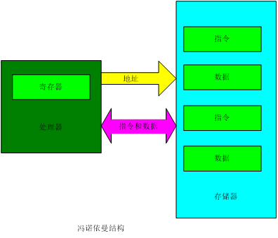
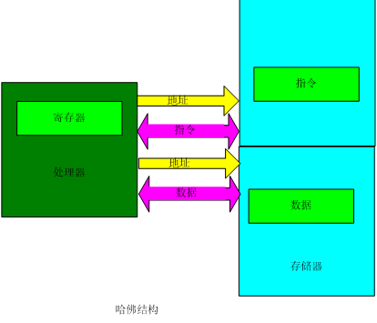

# ISA体系结构分类
1. 堆栈型(Stack)：操作数在栈顶，运算操作不用指定操作数
2. 累加器型(Accumulator)：一个操作数总在累加器中，结果也写回累加器
3. 寄存器型(Register)，每个操作数都由指令指定
- Register-Register型，又称为Load-Store型，所有运算操作的操作数都在寄存器中
- Register-Memory型
- Memory-Memory型
上述三种指令系统类型也可以分别称为0地址指令，单地址指令，以及多地址指令

早期的计算机多用堆栈和累加器型指令
- 出于降低硬件复杂度的考虑
- 现在已经不用（Intel有点例外）
80年代后的机器主要是寄存器型
- 访问寄存器比访问存储器快
- 便于编译器使用和优化(操作单一，寄存器vs.内存)
- 寄存器可以用来存放变量，减少访存次数

# 存储器结构
## 冯诺依曼结构
计算机应包含运算器、控制器、存储器、输入设备和输出设备五大基本部件；
计算机内部采用二进制形式表示指令和数据；
事先将编好的程序和始数据放入存储器中，计算机工作的时候能够自动高速地从存储器中提取指令并执行。

- 哈佛结构

# CISC和RISC
复杂指令集计算机CISC（Complex Instruction Set Computer）增加指令的复杂度，一条指令在多个时钟周期内完成。
精简指令集计算机RISC（Reduced Instruction Set Computer）的思想起源于1980年斯坦福大学的一项处理器研究项目。RISC的指令是在单个时钟周期内完成的。
## CISC
指令集虽大，但指令使用频度不均衡
微程序控制器制约了速度提高，因为存放微码的存储器速度比CPU慢5-10倍；CPI很大；
CISC不利于先进指令级并行（ILP）技术的采用；
编译器代码优化困难。

## RISC
精简指令集（reduced instruction set）
典型的RISC处理器的结构：MIPS，ARM
采用Load/Store结构，有助于大大减少指令格式，统一了存储器访问方式
采用硬接线控制代替微程序控制
流水线技术
减小CPI(Clock cycle Per Instruction): 
CPUtime=Instr_Count * CPI * Clock_cycle
# 流水线技术
流水线是实现多条指令重叠执行的技术，是加快CPU执行速度的关键技术。
- 流水级（pipe stage):
流水线由多个流水级组成，通常一条指令由n级流水级完成。每个流水级完成指令的部分任务。
- 吞吐量（throughput):
单位时间内流出流水线的指令数。
RISC指令的流水线实现分五步（即5个时钟周期）完成：
1. 取指令周期（IF）
2. 译码/读寄存器周期（ID）
3. 执行/有效地址计算（EX）
4. 存储器访问/转移完成（MEM）
5. 写回周期（WB）

6级流水：
IF级：取指令和计算新PC值。
ID级：指令译码。
DA级：计算源操作数的地址。
DM级：存储访问读写数据。 
EX级：ALU操作和MAC操作。
WB级：将ALU和load指令的输出结果写入寄存器文件。
