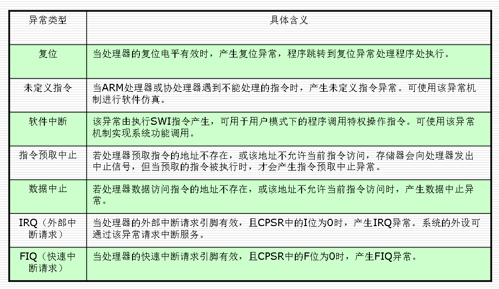

# 采用RISC架构的ARM微处理器的特点
体积小、低功耗、低成本、高性能；
支持Thumb（16位）/ARM（32位）双指令集，能很好的兼容8位/16位器件；
大量使用寄存器，指令执行速度更快；
大多数数据操作都在寄存器中完成；
寻址方式灵活简单，执行效率高；
 指令长度固定。

# ARM体系的特别技术
在同一条数据处理指令中包含算术逻辑处理单元处理和移位处理。
使用地址自动增加（减少）来优化程序中循环处理。
load/store指令可以批量传输数据，从而提高数据传输的效率。
所有指令都可以条件执行。

# ARM系列
## 名字解释
- T  - Thumb 架构扩展, 提供两个独立的指令集：
ARM 指令，均为 32位
Thumb指令，均为 16位
两种运行状态，用来选择哪个指令集被执行
- D - 内核具有Debug扩展结构
- M - 增强乘法器 (32x32) 支持64位结果.
- I  - Embedded ICE-RT逻辑---提供片上断点和调试点支持

## ARM7TDMI 是基于 ARM7 内核
- 3 级流水线---0.9MIPS/MHz
- 冯.诺依曼架构:只有数据存储器接口，同时用来取指令和数据访问。
- CPI(Clock-Cycle Per Instruction) 约为1.9 
- ARM7没有MMU,ARM720T是MMU的 

## ARM9
- 5级整数流水线，指令执行效率更高。
- 哈佛结构(1.1MIPS/MHz)：独立的指令和数据存储器接口，可同时取指和读写数据。
- 实现了一个周期完成loads指令和stores指令
- 支持32位的高速AMBA总线接口。
- 全性能的MMU，支持Windows CE、Linux、Palm OS等多种主流嵌入式操作系统。

## ARM9E
- 支持DSP指令集，适合于需要高速数字信号处理的场合。
- 5级整数流水线，指令执行效率更高。

## ARM10E
- 支持DSP指令集，适合于需要高速数字信号处理的场合。
- 6级整数流水线，指令执行效率更高。
- 静态分支预测
# 互锁(interlocks)技术
当指令需要的数据因为以前的指令没有执行完而没有准备好就会产生管道自锁互锁。
当管道互锁发生时，硬件会停止这个指令的执行，直到数据准备好为止。
编译器以及汇编程序员可以通过重新设计代码的顺序或者其他方法来减少管道互锁的数量。

RISC体系结构应具有如下特点：
采用固定长度的指令格式，指令归整、简单、基本寻址方式有2～3种。
使用单周期指令，便于流水线操作执行。
大量使用寄存器，数据处理指令只对寄存器进行操作，只有加载/ 存储指令可以访问存储器，以提高指令的执行效率。

除此以外，ARM体系结构还采用了一些特别的技术，在保证高性能的前提下尽量缩小芯片的面积，并降低功耗：
所有的指令都可根据前面的执行结果决定是否被执行，从而提高指令的执行效率。（条件执行）
可用加载/存储指令批量传输数据，以提高数据的传输效率。
可在一条数据处理指令中同时完成逻辑处理和移位处理。
在循环处理中使用地址的自动增减来提高运行效率。

Byte ：	 	8 bits (1 byte)
Halfword ：	16 bits (2 bytes)
Word :	 	32 bits (4 bytes)

# 字节顺序（大端/小端）
最高有效字节在最前面(低地址)的方式称为大端法

# 7个基本工作模式
User:非特权模式，大部分任务执行在这种模式
正常程序执行的模式
FIQ:当一个高优先级(fast)中断产生时将会进入这种模式
高速数据传输和通道处理
IRQ:当一个低优先级(normal)中断产生时将会进入这种模式
通常的中断处理
Supervisor:当复位或软中断指令执行时将会进入这种模式
供操作系统使用的一种保护模式
Abort: 当存取异常时将会进入这种模式
虚拟存储及存储保护(指令预取和存取操作)
Undef: 当执行未定义指令时会进入这种模式
软件仿真硬件协处理器
System: 使用和User模式相同寄存器集的特权模式
特权级的操作系统任务

# 寄存器结构
ARM处理器共有37个寄存器，被分为若干个组（bank），这些寄存器包括：
31个通用寄存器，包括程序计数器（PC指针），均为32位的寄存器。
6个状态寄存器，用以标识CPU的工作状态及程序的运行状态，均为32位，目前只使用了其中的一部分。
## R13
寄存器R13在ARM指令中常用作堆栈指针，但这只是一种习惯用法，用户也可使用其他的寄存器作为堆栈指针。
而在Thumb指令集中，某些指令强制性的要求使用R13作为堆栈指针。
由于处理器的每种运行模式均有自己独立的物理寄存器R13，在用户应用程序的初始化部分，一般都要初始化每种模式下的R13，使其指向该运行模式的栈空间，这样，当程序的运行进入异常模式时，可以将需要保护的寄存器放入R13所指向的堆栈，而当程序从异常模式返回时，则从对应的堆栈中恢复，采用这种方式可以保证异常发生后程序的正常执行。
## 人4
R14也称作子程序连接寄存器（Subroutine Link Register）或连接寄存器LR。当执行BL子程序调用指令时，R14中得到R15（程序计数器PC）的备份。其他情况下，R14用作通用寄存器。
与之类似，当发生中断或异常时，对应的分组寄存器R14_svc、R14_irq、R14_fiq、R14_abt和R14_und用来保存R15的返回值。

## THUMB下的寄存器
Thumb状态下的寄存器集是ARM状态下寄存器集的一个子集，程序可以直接访问8个通用寄存器（R0～R7）、程序计数器（PC）、堆栈指针（SP）、连接寄存器（LR）和CPSR。

## CPSR

# 异常

## 异常向量

## 异常优先级
