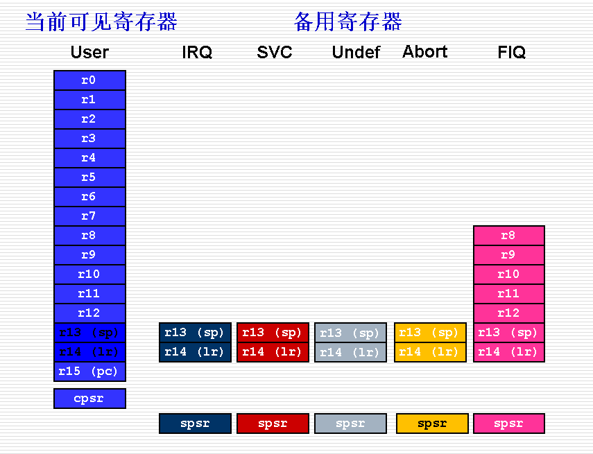
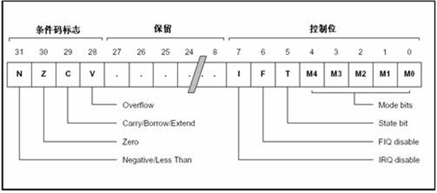

# 处理器模式 
非用户模式，或特权模式（Privileged Modes）：除用户模式以外，其余的所有6种模式
异常模式（Exception Modes）：其中除去用户模式和系统模式以外的5种，常用于处理中断或异常，以及需要访问受保护的系统资源等情况。
# 寄存器
- 未分组寄存器R0～R7
	在所有的运行模式下，未分组寄存器都指向同一个物理寄存器，他们未被系统用作特殊的用途，因此，在中断或异常处理进行运行模式转换时，由于不同的处理器运行模式均使用相同的物理寄存器，可能会造成寄存器中数据的破坏，这一点在进行程序设计时应引起注意。

- 分组寄存器R8～R14
对于分组寄存器，每一次所访问的物理寄存器与处理器当前的运行模式有关。
当使用fiq模式时，访问寄存器R8_fiq～R12_fiq；当使用除fiq模式以外的其他模式时，访问寄存器R8_usr～R12_usr。
- 程序计数器PC(R15)

## 程序状态寄存器的每一位的安排 
