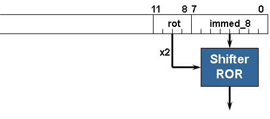
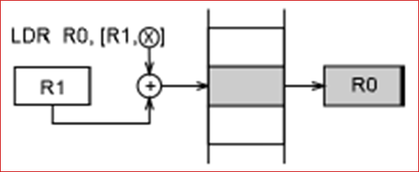
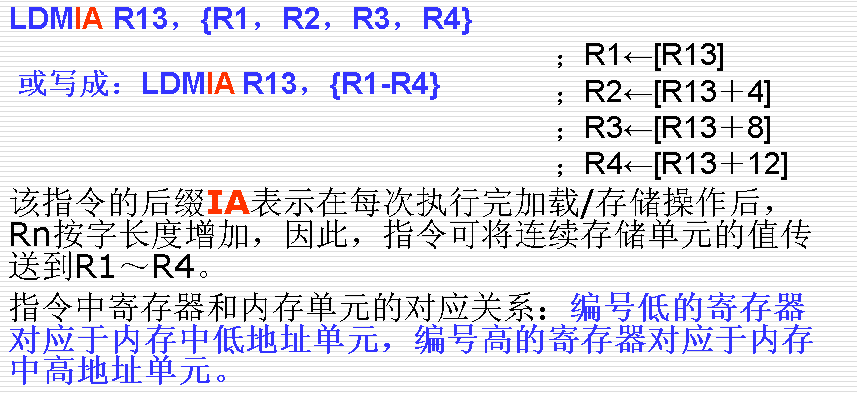
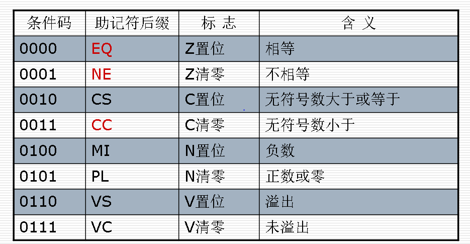
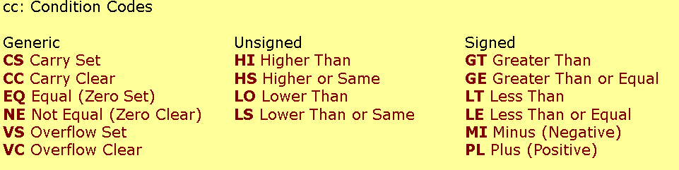

# 立即寻址
立即寻址也叫立即数寻址，这是一种特殊的寻址方式，操作数本身就在指令中给出，只要取出指令也就取到了操作数。这个操作数被称为立即数，对应的寻址方式也就叫做立即寻址。例如以下指令：
ADD R0，R0，＃1
# 立即数 

0x3F0转换为
Immed_8=0x3F, rotate_imm=0xE
or
Immed_8=0xFC, rotate_imm=0xF

# 寄存器寻址
   寄存器寻址就是利用寄存器中的数值作为操作数，这种寻址方式是各类微处理器经常采用的一种方式，也是一种执行效率较高的寻址方式。如下指令：
ADD R0，R1，R2  
# 寄存器间接寻址
寄存器间接寻址就是以寄存器中的值作为操作数的地址，而操作数本身存放在存储器中。例如以下指令：
LDR  R0，[R1]
STR  R0，[R1]
第一条指令将以R1的值为地址的存储器中的数据传送到R0中。
第二条指令将R0的值传送到以R1的值为地址的存储器中。

# 基址变址寻址
地址偏移量通常有以下三种表示方式：
使用一个绝对值不大于4095的数值，可使用带符号数，即在-4095~+4095之间
LDR R0, [R1]
LDR R0, [R1, #4]
LDR R0, [R1, R2]
LDR R0, [R1, R2, LSL #2]

## 事先更新寻址
LDR R0, [R1, #4]!
LDR R0, [R1, R2]!
LDR R0, [R1, R2, LSL #2]!
## 事后更新寻址（pre-index addressing）
LDR R0, [R1], #4
LDR R0, [R1], R2
LDR R0, [R1], R2, LSL #2
# 数据移动寻址方式
# 内存寻址方式
# 多寄存器寻址
采用多寄存器寻址方式，一条指令可以完成多个寄存器值的传送。这种寻址方式可以用一条指令完成传送最多16个通用寄存器的值。以下指令：

# 堆栈寻址
满递增堆栈 (FA)：堆栈指针指向最后压入的数据，且由低地址向高地址生成。
满递减堆栈(FD) ：堆栈指针指向最后压入的数据，且由高地址向低地址生成。
空递增堆栈(EA) ：堆栈指针指向下一个将要放入数据的空位置，且由低地址向高地址生成。
空递减堆栈(ED) ：堆栈指针指向下一个将要放入数据的空位置，且由高地址向低地址生成。

# 块拷贝寻址
IA (increment after) 	事后递增方式
IB (increment before) 	事先递增方式
DA (decrement after) 	事后递减方式
DB (decrement before) 	事先递减方式

# 相对寻址

ARM里面的堆栈是满递减（FULL DESCENDING）的。SP指向最后一个入栈的数据，SP的地址由高向低生长。对于LDM和STM指令来说，编号小的寄存器对应堆栈中的低地址。

# 条件指令

