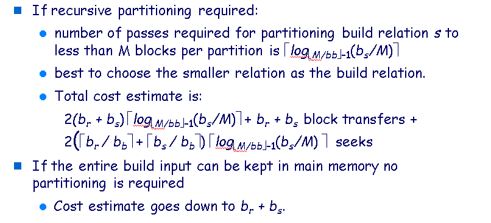
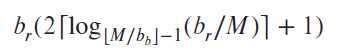
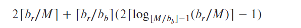

# Chapter 15: Query Processing

**Query processing** refers to the range of activities involved in extracting data from a
database.

## 15.1 | Overview

Three basic steps in query processing:
1. Parsing and translation.
2. Optimization.
3. Evaluation.

Before processing a query, the system must translate it to a machine-usable form based on the extended relational algebra. 
The first action is to translate a given query into its internal form. This translation process is similar to the work performed
by the parser of a compiler (syntax checking). Then, The system constructs a
parse-tree representation of the query, which it then translates into a relational-algebra
expression.

Queries can be translated to its relational-algebra form in several different ways.
For example, consider the query:  
select salary
from instructor
where salary < 75000;

This can be translated into either relational-algebra expression:  
σsalary<75000 (Πsalary (instructor))  
Πsalary (σsalary<75000 (instructor))

Additionally, there are several algorithms to execute each relational algebra operation. For example, we can search for every tuple in instructor with a salary less than 75000, or we can use an index search if it's available.

Annotations may state the algorithm to be used for a specific operation or the particular index or indices to use. A relational-algebra operation annotated with instructions on how to evaluate it is called an **evaluation primitive**. A sequence of
primitive operations that can be used to evaluate a query is a **query-execution plan**.

The different ways that a query can be written can have different costs. **Query optimization** is where the system chooses the best execution plan.

### Section 15.2 was not covered in lecture.

## Statistical Information for Cost Estimation (from lecture notes)

To choose a query processing strategy, the DBMS may store the following information for each relation _r_:

- _nr_: The number of tuples in _r_.
- _br_: The number of blocks containing tuples of _r_.
- _Ir_: The size of a tuple in _r_.
- _fr_: The number of tuples of _r_ that fit into one block. Called the blocking factor.
- V(_A_, _r_): number of distinct values that appear in _r_ for attribute A; same as the size of ∏_A_ (_r_).

If tuples of rare stored together physically in a file, then _fr_ = | nr_ / _fr_ |.

## Cartesian Product Size Estimation (from lecture notes)
Let _r_ and _s_ be relations we want to perform a Cartesian product on. Then, _r_ x _s_ has _nr_ *  _ns_  number of tuples with each tuple being (_Ir_ + _Is_) bytes.

## Selection Size Estimation (from lecture notes)
For a selection query of the relational algebra form σ_A=v_ (_r_), the estimated number of records that will satisfy the selection is _nr_ / V(_A_, _r_), assuming that the values of _A_ are uniformly distributed.

## Join Size Estimation (from lecture notes)
Let _R_ and _S_ be schemas we want to perform a join on.

There are four cases:
- If _R_ ∩ _S_ = ∅, then the size of _r_ ⋈ _s_ is the same as the size of _r_ x _s_ (aka _nr_ *  _ns_ ).
- If  _R_ ∩ _S_ = _K1_ and K1 is a key for _R_, then a tuple from _s_ will join with at most one tuple from _r_. Thus, the size of _r_ ⋈ _s_ is less than or equal to the size of _s_.
- If  _R_ ∩ _S_ = _K2_ and K2 is a key for _S_, then a tuple from _r_ will join with at most one tuple from _s_. Thus, the size of _r_ ⋈ _s_ is less than or equal to the size of _r_. 
- If  _R_ ∩ _S_ = {_A_} and _A_ is a not a key for _R_ nor _S_, then all tuples in _r_ will join with ( _nr_ * _ns_) / V(_A, s_) tuples in _s_. Thus, estimated size of _r_ ⋈ _s_ is ( _nr_ * _ns_ ) / V(_A, s_).
Similarly, the estimated size of _s_ ⋈ _r_ is ( _nr_ * _ns_) / V(_A, r_). Just choose the lower size. This under the assumption that the values of _A_ are uniformly distributed.

## 15.5 | Join Operation

For examples, we use the expression _student_ ⋈ _takes_ where
- Number of records of _student_: _nstudent_ = 5000.
- Number of blocks of _student_: _bstudent_ = 100.
- Number of records of _takes_: _ntakes_ = 10000.
- Number of blocks of _takes_: _btakes_ = 400.

### Nested-Loop Join

This algorithm is **nested-loop join** algorithm to compute the theta join, _r_ ⋈θ _s_, of two relations
_r_ and _s_. Relation _r_ is called the **outer relation** and relation _s_ the
**inner relation** of the join, since the loop for _r_ encloses the loop for _s_.

The algorithm denotes _tr_ and _ts_ as tuples; _tr ⋅ ts_ denotes the tuple constructed
by concatenating the attribute values of tuples _tr_ and _ts_.

The nested-loop join algorithm requires no indices, but is expensive since it examines every pair of tuples
in the two relations.

The worst case scenario is when the buffer can only hold on block of each relation. A total of **nr ∗ bs + br block transfers** are required along with **nr+br disk seeks**. Assuming worst case memory availability, cost estimate is (5000 * 400) + 100 = 2,000,100 block transfers and 5000 + 100 = 5,100 disk seeks assuming _student_ was the outer relation and _takes_ was the inner relation.

The best case is when one or both relations can fit in main memory, meaning each block only has to be read once. Thus, there is a total of  **bs + br block transfers** and **2 seeks**. Additionally, if only one relation can fit in memory, it would be beneficial if that was the inner relation because it would only be read once. The cost estimate for our example would be 500 block transfers and 2 disk seeks for the best case.

### Block Nested-Loop Join

- 块传输为br * bs + br （关系r中的每个块与关系S的每个块中的记录做计算，内层关系s的每一块都需要读，一共要读br次，外层关系的每一块需要读到内存中）
- Seek：br +br 

### Indexed Nested-Loop Join 
最坏情况下，每次只能向内存读入外层关系的一个数据块，join的代价为
$$b_r* t_T +b_r * t_S + n_r * c$$

外层关系r的每一块都要读，因此传输br次，seek也是br次；对于r关系的每条记录，需要在s索引文件上进行查找，所以代价是 n_r*c（nr是外层关系的记录数目，c是使用join条件对内层关系s进行单次查找的代价（之前介绍的selection的计算代价）

### Merge-Join
- 传输的数据块数为br + bs
- seek的次数为 $(\lceil {br / bb} \rceil + \lceil bs / bb \rceil)$ 。

### Hash-Join Algorithm
若关系r和s进行join计算，采用Hash join实现的算法如下示意。
1. 采用hash函数h对r和s进行划分，内存中保留一个数据块作为每个划分的输出buffer
2. 对于每一个i，依次完成以下步骤：
   - 将si读入内存中，然后在JoinAttribute上建立内存中的hash索引。这个hash函数与生成划分的hash函数不一样
   - 将ri的数据块依次读入到内存中，对于其中的每一个记录tr，应用内存中的hash索引找到si中的记录ti，然后输出拼接好的结果（按照join计算原则，确定好属性）
   - 其中s称作build输入，r称作探查输入（用ri中的记录在si中查找）
   - Si上的hash索引是在内存中建立的，不需要访问磁盘，构造阶段与探查阶段只需要对构造输入和探查输入做一次扫描。
#### 不递归划分
- 总的数据传输块数为$2× (br + bs）+br + bs+2*2*n$
  在构造与探查阶段，每个划分需要读一次，块传输为br + bs。因为有的块不满，划分的块数可能大于br + bs。由于n个划分中每个划分中都有可能有一个不满的块，这个块需要读、写各一次。因此，对于每个关系，读取这些部分满的数据块需要$2*n$次的数据传输。一般4n的开销远远小于3(br + bs) ，可以忽略不记。
- seek需要$2（\lceil br / bb \rceil  + \lceil bs / bb\rceil ）$次
  设为输入和输出缓冲区分配了bb个数据块的大小，在构造和探查阶段，每个关系中的n个划分每一个需要1次seek，每个划分都可以顺序读

#### 递归划分
如果有递归划分，如果为每个划分分配了bb个数据块作为缓存，每一趟可将划分减少为原来的1/(M/bb-1)，不断重复直到每个划分最多占M个块为止，则划分s的趟数为 $\lceil log_{M/bb–1}(bs/M) -1 \rceil$

## Evaluation of Expressions
### Materialization（物化）
 generate results of an expression whose inputs are relations or are already computed, materialize (store) it on disk.  Repeat.
  *物化的方法*
  将表达式计算表达为一个运算符树，如讲义和教材的示意。采用物化的方式时，自底向上运算，每一个计算的结果存储在临时关系中，高层使用临时关系进行计算直到树的根结点。

### Pipelining（流水线）
    pass on tuples to parent operations even as an operation is being executed
    流水线方法减少临时关系的建立，提高查询指向效率。具体的，将多个关系操作组合成一个操作的流水线，一个操作的结果输出给另一操作作，例如25页的例子
    join产生的一个结果记录时，马上输入给投影操作去处理，避免存储中间结果，直接得到最终结果的记录。
    流水线方式比物化方法的优点在于不需要建立临时关系，减少了读写临时关系的代价和查询代价

流水线的实现有两种方法：生产驱动和消费驱动

需求驱动方法：系统不断地项位于流水线顶端的操作发出需要记录的请求，每当一个操作收到需要记录的请求，就计算下一个记录并返回。系统需要记录目前为止已经返回了哪些记录。

生产驱动方法。操作不等待记录的请求，而是积极第产生记录，通常每个操作作为单独的进程或线程。在每个操作之间维护buffer，低层的操作将记录送入到buffer中，高层的操作从buffer读记录。如果buffer满了，低层的操作就等待直到buffer有空闲空间。图示了buffer的作用。
需求驱动的实现采用iterator算子来实现，有以下函数open（）、next（）、close（）
具体细节见教材。

- Double buffering
   use two output buffers for each operation, when one is full write it to disk while the other is getting filled

## sort
transfer

seek
