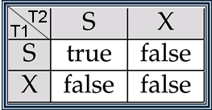
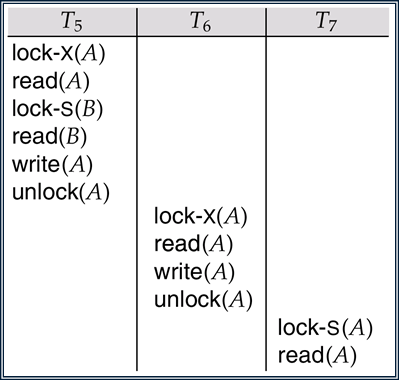
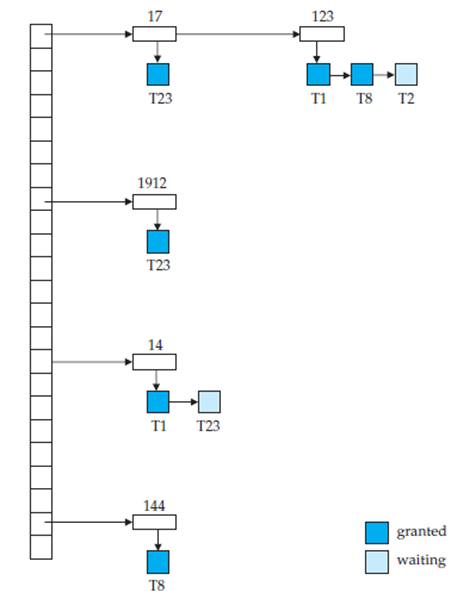
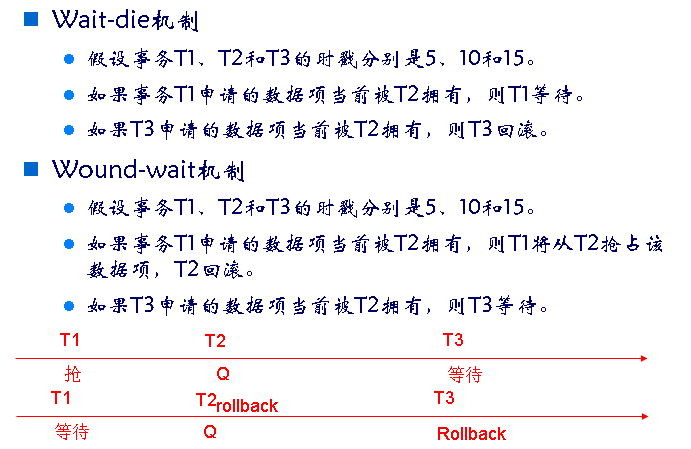

# 锁
1. 互斥锁 exclusive（X）
   如果事务持有数据项Q上的互斥锁，该事务即可以读也可以写数据项Q。Lock-X是请求锁的指令。
2. 共享锁shared（S）
   如果事务持有数据项Q上的互斥锁，该事务只能读不可以写数据项Q。Lock-S是请求锁的指令。
## 锁相容矩阵
T1已经拥有锁，T2申请对同一数据项加锁。矩阵中true表示批准，false表示冲突不相容，不批准，需要等待锁释放。

## 加锁协议
### 两阶段加锁协议
有时候写作2PL，是保证可串行的一个协议是两阶段加锁协议。该协议而要求每个事务分两个阶段提出加锁和解锁申请。
- 增长阶段：事务可以获得锁，但不能释放锁
- 缩减阶段：事务可以释放锁，但不能获得锁
事务一开始处于增长阶段，根据需要申请锁。一旦事务释放了锁，就进入缩减阶段

两阶段加锁协议并不能保证不发生死锁，级联回滚也可能发生
下图示意了级联回滚情况，当事务T7执行完read（A）之后，即到红色箭头处时，T5发生故障，T5回滚，导致T6和T7级联回滚。

### 严格两阶段解锁协议\强两阶段加锁协议
级联回滚可以通过严格两阶段加锁协议加以避免。
严格两阶段解锁协议（strict）
1. 两阶段加锁
2. 事务一直拥有互斥锁，直到事务提交或中止。未提交事务写的数据在提交之前被互斥锁封锁，防止其他事务读这些数据。
另一个两阶段加锁协议的变体是强两阶段加锁协议（rigorous）
1. 两阶段加锁 
2. 事务持有所有的锁，直到事务提交或中止。也就是说事务提交之前不是放任何锁

这两个协议是商用DBMS常用的加锁协议

### Two-phase Locking with Lock Conversions
First Phase:        
- can acquire a lock-S on item
- can acquire a lock-X on item
- can convert a lock-S to a lock-X (upgrade)
Second Phase:
- can release a lock-S
- can release a lock-X
- can convert a lock-X to a lock-S  (downgrade)
基本的两阶段加锁协议可以加以修改：在成长阶段，可以为数据项申请共享锁；可以为数据行申请互斥锁；可以将共享锁升级为互斥锁；在缩减阶段，可以释放共享锁，可以释放互斥锁，可以将互斥锁降级为共享锁。
参见教材P668-669的例子介绍。通过锁转换可以提高并发度。

## 加锁实现技术
加锁实现技术。加锁操作的实现由锁管理器来完成，它可以实现为单独的一个进程，接收事务发来的加锁、解锁请求。

锁管理器针对锁请求消息返回授予锁的消息，或者要求事务rollback的消息。发出请求的事务一直等待直到请求被响应。

锁管理器为每一个数据项维护一个称作“锁表”的数据结构，每一个请求为链表中的一个记录，记录事务发出的请求、请求什么类型的锁，是否请求被应答且授予锁，按请求到达顺序排序。
通常锁表的实现采用内存中的hash表结构。
这个表包含5个不同数据项的锁，数据项分别为 I4, I7, I23, I44, and I912，锁表采用溢出链，因此每一个数据项有一个已授予锁或等待授予锁的事务列表。图中示意事务T23（蓝色标识）在数据项I7、I912上已被授予锁；事务T1和T8在数据项I23上已被授予锁，T12等待被授予。T8在数据I44上已被授予锁，T1在数据I4上已被授予锁，事务T23等待数据I4被授予锁。
锁管理器处理请求的过程：
1. 当一条锁请求消息到达时，如果相应数据项的链表存在，再该链表末尾增加一个记录；否则新建一个仅包含该请求记录的链表。
2. 当锁管理器收到一个事务的解锁消息时，删除与该事务对应的数据项链表中的记录，然后检查随后的记录，如果有，就判断该请求能否被授权；如果能，锁管理器授权该请求并处理后面的记录，如果还有记录就逐一处理。
3. 如果一个事务中止，锁管理器删除该事务产生的正在等待加锁的所有请求。一但数据库采取适当操作撤销该事务（redo/undo）,该中止事务持有的锁全被释放。

这个算法保证了锁请求无“饿死”现象。

## 死锁预防协议
- 每个事物开始执行前获得所有的锁，同时获得所有的锁来保证不会发生循环
这种方法简单，但是事务开始执行之前很难预知哪些数据需要封锁；而且有些数据会长时间封锁，导致数据的使用效率降低。
- 通过对加锁请求进行排序
对所有的数据项强加一个次序，要求事务按照这个词序加锁。这种方法的一个变种是使用数据项与2PL封锁关联的全序，即一旦一个事务封锁了某个特定的数据型，就不能申请位于该数据向前面的数据项的锁。
- 每当等待有可能死锁时，事务回滚而不是等待加锁。
通过抢占或回滚来预防死锁。每仍然使用加锁机制，但是个事务分配一个是时间戳，系统利用时间戳来决定事物等待还是回滚。有两种不同的死锁预防模式：
 wait-die和wound-wait

这两种模式都需要给事物赋予时间戳。
1. wait-die模式，基于非抢占技术
         年长的事务等待年轻的事务释放锁，年轻的事务不等待年长事务释放锁，而是rollback
2. wound-wait，基于抢占技术
         年长事务强迫年轻事务回滚，“抢占”锁资源，年轻事务会等待年长事务释放锁。

Timeout模式是另一种处理死锁的简单方式，申请锁的事务至多等待一段给定的时间，若此时段内未被授予锁，该事务超时，就rollback，避免了死锁。这种方法看似简单，但是确定等待时长很困难。
# 并发控制机制
## 基于时间戳的并发控制机制
每个事务分配一个时间戳（时间戳系统时钟或逻辑计数器），TS(Ti) < TS(Tj)表示事务Ti的时戳值< Tj.的时戳值，Ti 是年长事务，Tj 是新事务。根据时间戳确定可串行化的顺序来控制并发执行的事务。

实现时，每个数据项Q需要与两个时间戳关联：
1. w-timestamp（Q）：成功执行write（Q）的所有事务的最大时间
2. R-timestamp（Q）：成功执行read（Q）的所有事务的最大时间戳
基于时间戳的并发控制协议保证冲突的write和read操作以时戳的次序执行的方式执行。具体执行方式如下。
假设事务Ti发出read（Q）的操作：
1. 如果 TS(Ti) ＜ W-timestamp(Q), 那么 Ti 需要读的数据项Q的值已经被覆盖，因此这个read 操作被拒绝，Ti rolledback.
2. 如果TS(Ti) W-timestamp(Q), 那么执行read操作，更新R-timestamp(Q) 为max(R-timestamp(Q), TS(Ti)).

假设事务Ti发出write（Q）的操作：
1. 如果 TS(Ti) ＜ R-timestamp(Q), 那么 Ti 更新后的数据项Q的值是先前需要读的值，且系统已经假设该值不会再产生，因此这个write 操作被拒绝，Ti rolledback.
2. 如果TS(Ti)＜W-timestamp(Q), 那么Ti试图写的值是过时的，因此write（Q）被拒绝，Ti Rollback
3. 否则，执行write操作，W-timestamp（Q）更新为TS(Ti).

### 基于时间戳协议的正确性。
这个协议可以保证冲突串行化，因为冲突操作可以按照时间戳排序。讲义上的图示意优先图中的边都是如此，有序的。
这个协议保证不会出现死锁，因为没有事务在等待。
但是这个协议可能导致调度不是无级联的，且可能产生不可恢复的调度。可以通过以下方法来保证调度可恢复：
1. 在事务的末位执行所有的写操作，这些写操作必须正在执行的过程中，任何事务都不允许访问已写完的任何数据项。
2. 通过受限的封锁形式来保证可恢复性和无级联性，对于未提交数据项的读操作推迟到更新该数据项的事务提交之后，即不要读到脏数据。
3. 通过跟踪未提交写操作来保证可恢复性。事务Ti读取了其他事务所写的额数据，只有在其他事务提交之后，Ti再提交。
Thomas写规则是对基于时间戳协议的一种修改，同学们自学。

## 多版本时间戳排序
假设事务Ti发出read（Q）或write（Q）操作，设Qk表示Q满足如下条件的版本，它的写时间戳是≤TS(Ti)的最大的写时间戳
（1）如果事务Ti发出read（Q）操作，则返回值是版本Qk的内容；//事务读当前最近版本的数据
（2）如果事务Ti发出write（Q）操作，则   //规定了写操作太迟（时间戳< R-timestamp(Qk））的话，就中止。也就是去写已经被读过的数据，就不要写了
       （a）如果TS(Ti) < R-timestamp(Qk), 那么Ti就rollback。 
       （b）如果TS(Ti) = W-timestamp(Qk), 那么 Qk 的内容被重写
        （c）否则创建Q的一个新版本。

多版本时间排序机制读请求从不失败，且不必等待（在一些查询为主的应用中经常采用这种并发控制机制，比如搜索平台）
但是，读数据需要更新R-timestamp字段，有两次磁盘访问；另外发生冲突时通过rollback而不是等待来解决，开销很大。由此产生了多版本两阶段加锁机制。

多版本两阶段加锁机制将读操作和更新操作分开处理。

1. 更新事务（写操作）请求读和写锁，而且一直持有直到事务提交。也就是说，遵守强2PL（rigorous two-phase locking），可以实现可串行化。
数据项的每个版本有一个时间戳，不是系统时间，用一个计数器ts-counte来标记。
2. 只读事务在执行前，分配当前的计数器的值作为时间戳，然后遵守多版本时间戳协议进行读操作。

## 多版本2PL
当一个更新事务（有写操作的事务）读一个数据时，获得共享锁后读最近的版本
当一个更新事务想要写数据时，获得互斥锁后创建数据项的新版本，并将时间戳设置为无穷大。
当更新事务Ti完成后，提交处理时，将创建的数据版本的时间戳值设置为ts-counter + 1，ts-counter ++；这样在Ti完成ts-counter递增之后的只读事务会读到更新后的值，而在ts-counter递增之前的只读事务只能读到Ti更新操作之前的值。

遵守这个协议了保证可串行化调度。

## MVCC实现的一些问题：
1. 增加空间开销：多个版本的存储
2. 垃圾回收问题：旧版本不再需要时需要删掉

## 快照隔离
是一种特殊的并发控制机制，在商用DBMS广泛使用，如Oracle，SQLServer，PostgreSQL。在事务开始执行时，给他数据库的一个快照，事务在快照上操作，和其他并发事务隔离开，快照中的数据值近包括已经提交的事务所写的值（持久化的）。 

快照隔离方法产生的动机是：在做一些决策支持查询时，会读大量的数据（大数据应用），可能会和修改少量数据的OLTP（联机事务处理）事务发生并发冲突。决策分析时可以忽略一些小量的更新数据。

解决此类并发执行的方法：
1. 对于只读的事务（查询应用），让他们访问数据库的一个逻辑快照；读写事务采用正常的加锁机制
2. 让所有事务访问访问数据库的快照，修改操作的事务采用2PL来保证避免并发修改。
这两种方法都有一些问题，商用的DBMS有自己的实现变种。下面具体介绍快照隔离的基本内容。

事务T采用快照隔离方法执行时，
- 执行开始时采用提交后的数据快照
- 在快照上完成读和写操作
- 并发事务的修改操作对事务T不可见
- 事务T提交时完成写操作

两个并发的事务可能会更新同一个数据项，由于两个事务各自采用自己的快照，看不到对方的更新。如果允许两个事务写入数据库，就导致第一个事务的写入被第二个事务的写入覆盖，即更新丢失。必须预防这个现象发生。快照隔离方法的两个变种方法避免了更新丢失：first committer wins（先提交者获胜）和first updater wins （先更新者获胜）

按照先提交者获胜方法，当事务T进入部分提交状态，以下操作作为一个原子操作执行：
1. 检查是否有与事务T并发执行的事务，对于T打算写入的某些数据，该事务已经将更新写入数据库
2. 如果有这样的事务，T中止
3. 如果没有这样的事务，则T提交，并将更新写入数据库

按照先更新获胜方法，系统采用仅用于更新操作的加锁机制（读操作不受影响）。当事务Ti试图更新数据时，请求该数据项的互斥锁，如果没有另一个并发事务持有该数据项的锁，则获得锁后执行：
1. 如果数据项被其他并发事务更新过，那么Ti中止
2. 否则，Ti执行其操作，可能会提交（成功执行完）

若另一个并发事务Tj持有该数据的互斥锁，则Ti不能执行，执行以下步骤
（1）Ti等待直到Tj提交或中止
     （a）如果Tj中止，则释放锁，Ti获得锁，Ti执行上述的更新检查。如果有另一个事务更新过这个数据项，Ti中止，否则执行其操作。
     （b）如果Tj提交，Ti中止（不再更新数据）