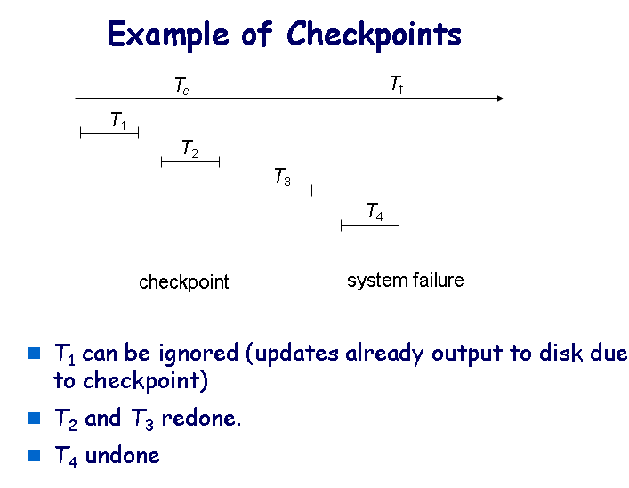

# 故障分类
- 事务故障：两种错误导致事务故障，逻辑错误和系统错误，其中逻辑错误就是程序逻辑写错了；系统错误指DBMS本身原因导致的错误，如死锁等
- 系统崩溃：软硬件故障导致的系统中止，主存中的信息丢失。例如掉电、软件漏洞等
- 磁盘故障：磁盘设备故障，如读写头、磁盘本身写数据问题等
确定了故障的源头，就有针对性的故障恢复机制。从数据管理的角度，需要考虑故障对数据库中的数据的影响。故障恢复算法是在故障发生后仍能保持数据库中的数据一致性以及事务的原子性的算法，后续介绍。
# 存储器
- 易失性存储：当系统故障时，其中的数据丢失，例如主存、cache等都属于易失性存储
- 非易失性存储：系统故障时，其中的数据不会丢失，例如磁盘、磁带、flash以及有电源支撑的RAM
- 稳定存储：是一种理想的存储器，可以在任何故障情况下不损坏数据，通常用异地保存多个副本的方式来实现，如两地三备份

## 稳定存储器
在不同磁盘上维护多个副本——鸡蛋不要放在一个篮子里
在建立多个副本的数据传输过程中，即从内存传输到磁盘的过程中，数据会发生不一致的情况。数据块传输可能有以下几种结果：
（1）成功完成传输，传输的信息成功到达目标磁盘；
（2）部分失败：传输过程中发生股脏，目标数据块有不正确的信息；
（3）完全失败：目标磁盘上的数据没有被更新，即还没来得及传输数据就发生故障了。

为了保护数据传输过程中存储介质免受故障的影响：可以采用将每个数据块分别写到两个物理数据块中的方法，步骤如下：
（1）将数据写到第一个物理块中；
（2）当第一个写操作成功完成之后，将同样的数据写到第二个磁盘上
（3）当第二次写操作成功完成时，发出确认信息，完成数据传输。

事务由磁盘向主存输入信息，然后将信息输出到磁盘，输入和输出操作以数据块为单位，磁盘和主存之间的块移动由以下两个操作完成：
- input(B) 将物理块B传输到主存.
- output(B) 将缓冲块B传输到磁盘，并替换磁盘上的相应的物理块

事务Ti通过其私有工作区和系统缓冲区之间传输数据，与数据库系统进行交互，使用以下两个操作完成数据传递：
read(X) 将数据项X的值赋予局部变量xi.
write(X) 将局部变量xi 的值赋予缓冲块中的数据项X
两个操作都需要考虑数据块是否在主存中，如果不在就发指令input(BX) 。

事务第一次访问数据时，必须执行read(X) ，之后的操作作用于局部的拷贝x，最后一次访问数据后，事务执行write(X）

output(BX) 不必要在write(X)之后立刻执行（因为数据块B中可能还有其他正在被访问的数据），系统在合适的时候执行output(BX)将数据写到磁盘上。
注意：在完成了write(X)之后没有开始output(BX)之前，系统有可能崩溃，X的新值没有持久化到磁盘上，会丢失X的更新。如何解决？

## Log-Based Recovery
日志是日志记录的序列，记录数据库所有更新数据的活动，包括以下字段：
- 事务的标识，区分不同的事务
- 数据项标识，区分访问的数据项
- 数据项的旧值，数据更新前的值
- 数据项的新值，数据更新后的值
在日志中，一些记录是：
- < Ti  start> ，记录事务Ti的开始
- < Ti, X,  V1,  V2>，记录事务Ti对数据项X进行了一个写操作，写操作前X的值是 V1，写操作之后更新为V2
- < Ti  commit>，记录事务Ti成功提交
- < Ti  abort>，记录事务中止 

### 事务在进行数据修改时的步骤
1. 事务在主存中自己的私有工作区执行数据访问和计算
2. 事务修改主存中磁盘缓冲区中包含该数据项的数据块
3. 数据库系统执行output操作，将数据持久（写）到磁盘上。
如果一个事务执行了对磁盘缓冲区或磁盘的更新，则这个事务修改了数据库；
如果仅仅更新了事务私有工作区中的数据，不算数据库修改。

### 数据库修改的实现方式
立即数据库修改模式和延迟数据库修改模式。本章的恢复算法支持立即数据库修改模式。
### 立即数据库修改
在事务在活跃时，数据库修改就发生了。
采用立即数据库修改模式时，系统恢复算法有两个重要的操作：undo和redo
1. undo操作：将log记录 <Ti, X,  V1,  V2>中旧值写到X中，即将事务Ti更新过的所有数据设置成旧值
2. redo操作：将log记录 <Ti, X,  V1,  V2>中新值写到X中，即将事务Ti更新过的所有数据设置成新值
两个操作都是等幂的，即执行多次的结果与执行一次的结果一样。

Q：当系统故障恢复时何时执行redo？何时执行undo？
A：根据日志记录，如果日志包含<Ti start>但不包含 <Ti commit>，undo(Ti)；如果日志既包含<Ti start>又包含 <Ti commit>，redo(Ti).

#### checkpoint
1. 将当前主存中的日志记录写到稳定存储上（持久化）
2. 将所有修改的buffer块写到磁盘上（持久化）
3. 在稳定存储器上加一条记录< checkpoint L>，其中L是执行checkpoint时活跃的事务列表。
当执行checkpoint操作时，所有更新操作都停止。
日志中有了checkpoint，如何利用它来恢复？只需考虑checkpoint之前最近的事务，然后从该事务开始的事务。这样search log时不必扫描所有的记录。具体操作如下：
1. 从log文件的末端开始反向扫描，知道找到最近的< checkpoint L> 记录
2. 继续向后扫描直到记录< Ti start> 出现；
3. 只需考虑从这个start开始的log部分记录，再往前的记录不需要访问了；
4. 对于所有的事务，如果没有< Ti commit>，则执行undo(Ti).（以立即数据库修改模式为例）
5. 继续正向扫描log，如果遇到 < Ti  commit>, 则这个事务既有< Ti start> ，也有< Ti  commit>, 则执行redo(Ti)

### 回滚过程
#### Redo阶段：
1. 在log文件中，找到最近的< checkpoint L> 记录，将要rollback的事务list，即undo-list设置为L.
2. 从< checkpoint L> 记录开始正向扫描log
    （a）一旦找到记录 < Ti, Xj,  V1,  V2> ，redo（Ti）
    （b）一旦找到记录< Ti  start> 就将Ti 加到undo-list
    （c）一旦找到记录 < Ti  commit> 或< Ti abort> ，将Ti 从undo-list中移除
在redo阶段的最后，undo-list中记录了系统崩溃前尚未完成的事务，它们既没有提交也没有完全rollback。

#### undo阶段
从log文件的末尾反向扫描
1. 一旦发现log记录 <Ti, Xj,  V1,  V2> ，Ti在undo-list中，就执行undo操作（和25页介绍的rollback操作一样）
2. 一旦发现undo-list中事务Ti的log记录 <Ti start> ，执行下面的操作
      （a）在log文件中追加一条记录<Ti  abort> 
      （b）将Ti从undo-list中删掉
3. 当undo-list为空时，系统找到了初始时undo-list中所有的事务的  <Ti start> 记录，undo阶段结束
Undo阶段完成后，正常的事务开始执行

### 延迟数据库修改：事务提交时，数据库都没修改

# Log Record Buffering
WAL(write-ahead logging)
主存中的数据写到磁盘之前（数据库中），日志先写到稳定存储，
