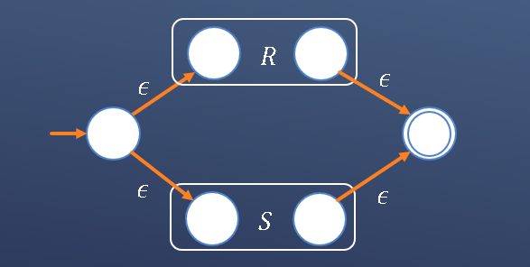
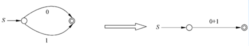
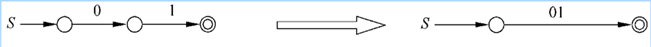
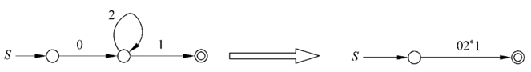
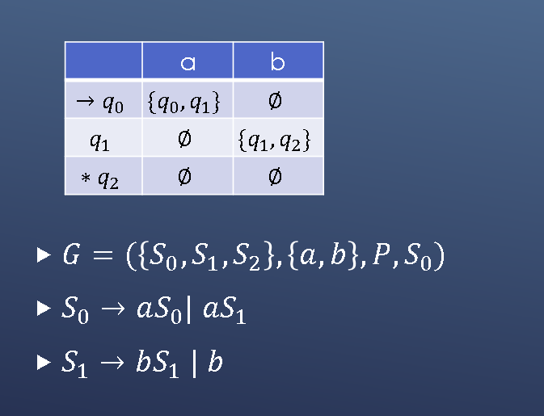
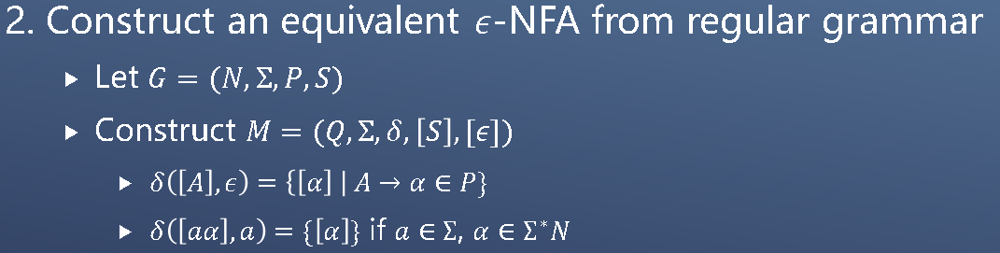
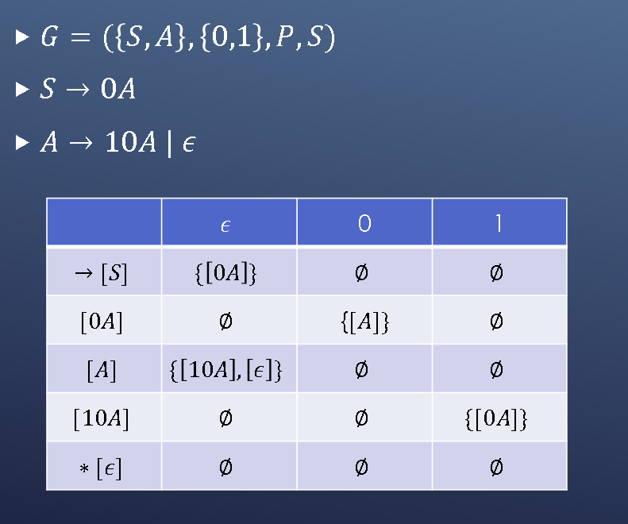
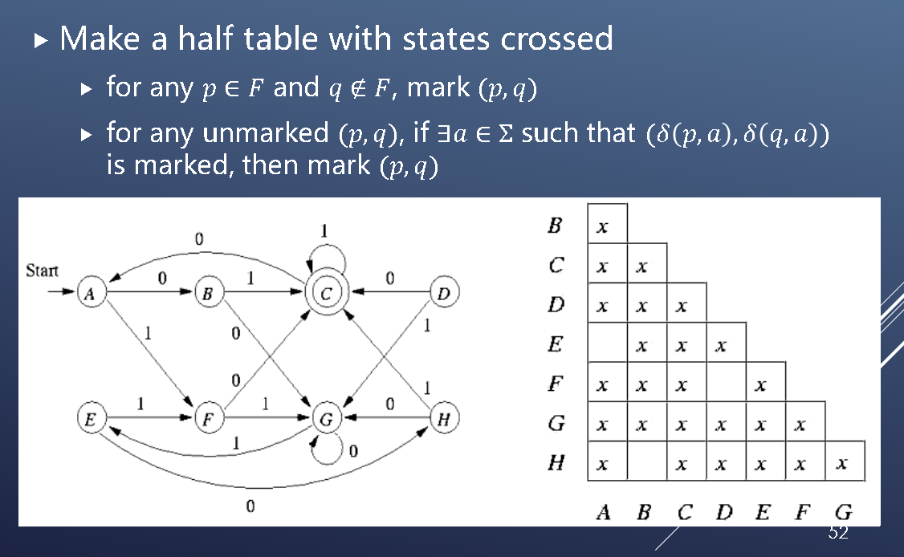

# 概念
# 性质
Basis: 𝐿(𝜖)=\{𝜖\}, 𝐿(∅)=∅, 𝐿(𝑎)={𝑎}
$$𝐿(𝑟_1+𝑟_2 )=𝐿(𝑟_1 )∪𝐿(𝑟_2 ) \\
𝐿(𝑟_1.𝑟_2 )=𝐿(𝑟_1 )𝐿(𝑟_2 ) \\
𝐿(𝑟^∗ )=𝐿(𝑟)^∗$$

## 有限自动机和正则表达式等价
For every regular expression R there is a 𝜖-NFA A such that L(A) = L(R).
- R+s

- R.S

- $R^*$

For every DFA A we can find a regular expression R such that L(R) = L(A).
- Merge

- Eliminate sequential state:

Eliminate loop state:

# 正则文法
𝐺=(𝑁,Σ,𝑃,𝑆)
Every production in P is of the form 𝐴→𝜎𝐵 or 𝐴→𝜎 where 𝐴,𝐵∈𝑁 and 𝜎∈Σ^∗
## 有限自动机与正则文法等价性(见PPTch2-3 21-24)
1. L can be accepted by a NFA, if and only if L has a regular grammar
Construct an equivalent regular grammar from a NFA
Let 𝑀=(𝑄,Σ,𝛿,𝑞_0,𝐹) with 𝑄={𝑞_0,…,𝑞_𝑛}
Construct a grammar 𝐺=({𝑆_0,…,𝑆_𝑛 },Σ,𝑃,𝑆_0)
$$𝑆_𝑖→𝑎𝑆_𝑗 \ if 𝑞_𝑗∈\delta (𝑞_𝑖,𝑎) \ and \ 𝑞_𝑗 \not \in 𝐹  \\
𝑆_𝑖→𝑎𝑆_𝑗  | 𝑎 \ if 𝑞_𝑗∈ \delta (𝑞_𝑖,𝑎) \ and \ 𝑞_𝑗 \in 𝐹
$$

2. Construct an equivalent 𝜖-NFA from regular grammar
Let 𝐺=(𝑁,Σ,𝑃,𝑆)
Construct 𝑀=(𝑄,Σ,𝛿,[𝑆],[𝜖])

## 正则表达式性质
Let R and S be RE with the same alphabet Σ, R=S iff 𝐿(𝑅)=𝐿(𝑆)
- Commutativity & Associativity 
$$𝑅+𝑆=𝑆+𝑅 \\
(𝑅𝑆)𝑇=𝑅(𝑆𝑇) \\
(𝑅+𝑆)+𝑇=𝑅+(𝑆+𝑇)$$
- Identity & Annihilator
$$∅+𝑅=𝑅+∅=𝑅 \\
𝜖𝑅=𝑅𝜖=𝑅 \\
∅𝑅=𝑅∅=𝑅$$
- Distributive
$$𝑅(𝑆+𝑇)=𝑅𝑆+𝑅𝑇 \\
(𝑅+𝑆)𝑇=𝑅𝑇+𝑆𝑇$$
- Idempotent(幂等)
$$𝑅+𝑅=𝑅 \\
{(𝑅^∗)}^∗=𝑅^∗  $$
- Closure \
∅^∗=ϵ 𝜖^∗=𝜖 \
𝑅^+=𝑅𝑅^∗=𝑅^∗ 𝑅 \
𝑅?=𝜖+𝑅

## 使用泵引理证明一个语言不是正则语言
Let L be a regular language. Then there exists a constant n such that for every string 𝑤∈𝐿 with |𝑤|≥𝑛, we can break w into three substrings w = xyz such that
$$
𝑦≠  \epsilon \\
|𝑥𝑦|≤𝑛 \\
For \ all \ 𝑘≥0, 𝑥𝑦^𝑘 𝑧∈𝐿
$$

## Myhill–Nerode theorem (语言是正则语言的充要条件)
- Distinguishing Extension(区别扩展) \
Given a language 𝐿 and two strings 𝑥,𝑦 \
String 𝑧 such that exactly one of 𝑥𝑧 and 𝑦𝑧 belongs to 𝐿

- Myhill–Nerode Relation $𝑅_𝐿$ \
$(𝑥,𝑦)∈𝑅_𝐿$ iff there is no distinguishing extension for 𝑥,𝑦 \
𝑅_𝐿 is an equivalence relation \
𝑅_𝐿 divides 𝐿 into many equivalence classes

- Language 𝐿 is regular if and only if $𝑅_𝐿$ has a finite number of equivalence classes
- The number of states in the smallest DFA recognizing 𝐿 is equal to the number of equivalence classes in $𝑅_𝐿$
- There is a unique minimal DFA with minimum number of states recognizing 𝐿
- 证明：
1. 等价类数$\le$DFA状态数：每个等价类一定有一个对应的DFA状态
2. 等价类数$\ge$DFA状态数：一个等价类建立一个DFA状态，证明建立的DFA一定能接收正则语言L

## DFA最小化算法
- 算法1：Compute all distinguishable states in a given DFA
- 算法2：Table-Filling algorithm
Basic: if 𝑝∈𝐹 and 𝑞∉𝐹, then mark (p,q)标记为可区别的 \
Inductive: if there exists 𝑎∈Σ such that (𝛿(𝑝,𝑎),𝛿(𝑞,𝑎)) is marked, then mark (p,q)

- 算法3：Merge all equivalent states 

## 判定性问题
### 定义
Given a language as a input \
determine a Boolean answer with a terminating algorithm
### 判定性问题的特点
- 一般无法遍历集合中所有元素
- 判定性问题的答案是yes or no
- 可判定是指存在一个在有限时间内能终止的算法，对任意输入都可以得到一个确定的答案
