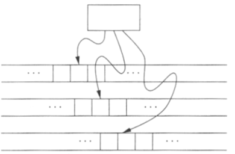
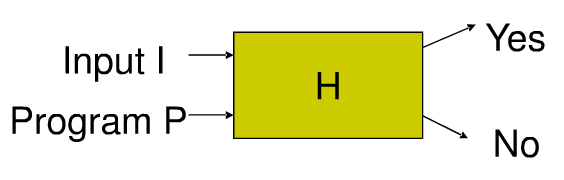
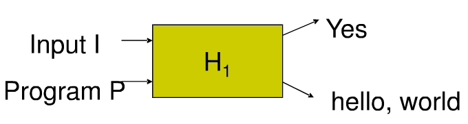

# Turing machine
A Turing machine is a 7-tuple (𝑄,Σ,Γ,𝛿,𝑞_0,𝐵,𝐹)
𝑄 is a finite set of states of the finite control
Σ is a finite set of input symbols
Γ is a set of tape symbols, Σ⊂Γ
𝛿:𝑄×Γ→𝑄×Γ×{𝐿,𝑅} is a transition function
𝑞_0∈𝑄 is a start state  
𝐵∈Γ−Σ is blank symbol 
𝐹⊆𝑄 is a set of final (accept) states
## Language of a TM
Recursively Enumerable Language
A TM can accept any string that can reach its final state even if the string is not all scanned.

## Multi-tape TM
A multi-tape TM has a finite control and finite number of tapes.
Initially, the input is placed on the first tape. The head of the first tape is at the head of the input. The head of other tapes are at arbitrary cell.
The head of each tape moves independently

## Non-deterministic TM

## 图灵机和0型文法的等价性

𝐿 can be generated by 𝐺=(𝑉,𝑇,𝑃,𝑆), iff 𝐿 can be recognized by a Turing machine
Proof: (⇒)
Construct a TM 𝑀 with two tapes. One tape is for the input 𝑤∈𝐿(𝐺), the other tape is for the derivation of 𝑤 through 𝑃. 
Initially, put input string 𝑤 on tape 1 and start symbol 𝑆 on tape 2.
Apply a production rule 𝛼→𝛽∈𝑃 by replacing 𝛼 on tape 2 by 𝛽
Compare the 2 tapes.
If the string on tape 2 is equal to 𝑤, accept
If not, repeat applying production rules to nonterminal symbols
# Recursive Enumerable Language
## Recursive
If 𝑤∈𝐿, then 𝑀 halts on the accepting state
If 𝑤∉𝐿, then 𝑀 halts on an non-accepting state
## Non-Recursive
If 𝑤∈𝐿, then 𝑀 halts on the accepting state
If 𝑤∉𝐿, then 𝑀 may run forever and never halts
## Decidability(可判定性)
## The hello-world problem is undecidable
Proof: 
Assume that we have an algorithm H that can solve this problem with any given input I and program P
### H
H prints Yes when P prints “hello world” with input I
H prints No when P does not print hello-world with input I

### H_1
Build 𝐻_1 from 𝐻 such that 𝐻_1 prints hello world when 𝐻 returns no, that is, when the given program 𝑃 does not print hello world with the given input 𝐼
𝐻_1 (𝐼,𝑃)=𝐻(𝐼,𝑃)  if  𝐻(𝐼,𝑃)=𝑌𝑒𝑠
𝐻_1 (𝐼,𝑃)=ℎ𝑒𝑙𝑙𝑜, 𝑤𝑜𝑟𝑙𝑑  if  𝐻(𝐼,𝑃)=𝑁𝑜

#### H_2
Buld 𝐻_2 from 𝐻_1 such that 𝐻_2 takes program P as both input I and P
𝐻_2 (𝑃)=𝐻_1 (𝑃,𝑃)

### 证明过程
- Case 1: 𝐻_2 prints Yes (not hello world) with input 𝐻_2 
𝐻_2 (𝐻_2 )=𝑌𝑒𝑠
We have 𝐻_2 (𝐻_2 )=𝐻_1 (𝐻_2,𝐻_2 )=𝐻(𝐻_2,𝐻_2 )=𝑌𝑒𝑠
It means that the program 𝐻_2 prints hello, world with input 𝐻_2
- Case 2: 𝐻_2 prints hello world with input 𝐻_2
𝐻_2 (𝐻_2 )=ℎ𝑒𝑙𝑙𝑜, 𝑤𝑜𝑟𝑙𝑑
We have 𝐻_2 (𝐻_2 )=𝐻_1 (𝐻_2,𝐻_2 )=ℎ𝑒𝑙𝑙𝑜 𝑤𝑜𝑟𝑙𝑑 therefore 𝐻(𝐻_2,𝐻_2 )=𝑁𝑜
It means that 𝐻_2 prints no (not hello world) with input 𝐻_2
Contradiction!

## Halting Problem
Determine whether a given program can terminate with a given input
The halting problem is undecidable
The proof is given by Alan Turing in 1936
The hello-world problem is a variation of the halting problem
