# 上下文无关文法
A context-free grammar is a quadruple G = (V 𝑇, 𝑃, 𝑆 )
V is a finite set of variables.
T is a finite set of terminals.
P is a finite set of productions of the form 𝐴→𝛼 where 𝐴∈𝑉, 𝛼∈$(𝑉∪𝑇)^∗$
S is a designated variable called the start symbol

## Derivation(推导)
- Leftmost derivation $⇒_{𝑙𝑚} $
Always replace the leftmost variable by one of its rule-bodies.
- Rightmost derivation $⇒_{𝑟𝑚} $
Always replace the rightmost variable by one of its rule-bodies.

## parse tree(生成树)

## Ambiguous Grammar(二义性文法)
There can be several different derivations for a string
There can be several parse trees for the same derivation of a string
There is only one parse tree for a derivation of string 𝑤∈𝐿 if 𝐿 is unambiguous

## Ambiguity(二义性)
Good news: sometimes we can remove ambiguity from CFG
Bad news: there is no algorithm to do it
Bad news: There are CFLs that has only ambiguous grammars and it is impossible to remove the ambiguity
Good news: there are well-known techniques for eliminating ambiguity in common programming languages

## Leftmost derivation and ambiguity
For any CFG 𝐺, a string w has two distinct parse trees iff w has two distinct leftmost derivation

## Inherent Ambiguity
A CFL 𝐿 is inherent ambiguous if all grammars for 𝐿 are ambiguous

# 下推自动机（Pushdown Automata）
A pushdown automata (PDA) is essentially an 𝜖-NFA with a stack
A PDA is a 7-tuple 𝑃=(𝑄,Σ,Γ,𝛿,𝑞_0,𝑍_0,𝐹)
𝑄 is a finite set of states
Σ is a finite set of input symbols
Γ is a finite set of stack symbols
𝛿:$𝑄×Σ^{ \epsilon}×Γ→2^{(𝑄×Γ^∗ )}$ is a transition function
𝑞_0∈𝑄 is the start state
𝑍_0∈Γ is  the start symbol of the stack
𝐹⊆𝑄 is a set of final (accepting) states
## 例子
Consider 𝐿_𝑤𝑤𝑟={$𝑤𝑤^𝑅$  ┤|  𝑤∈{0,1}^∗} with grammar 𝑆→𝜖 | 0𝑆0 |1𝑆1

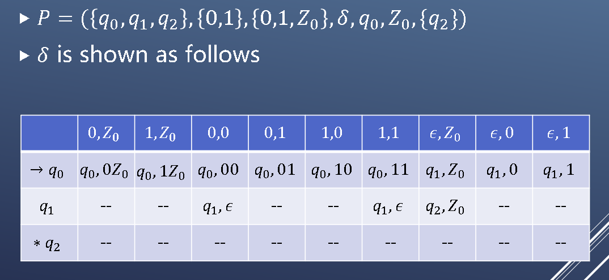

## 瞬时描述 (Instantaneous Description)
A ID of a PDA is a triple (𝑞,𝑤,𝛼)
𝑞 is the current state
𝑤 is the remaining input string
𝛼 is the current stack contents
Transitions of ID
∀𝑤∈Σ^∗,𝛽∈Γ^∗
(𝑞,𝑎𝑤,𝑧𝛽)⊢(𝑝,𝑤,𝛾𝛽)  if  (𝑝,𝛾)∈𝛿(𝑞,𝑎,𝑧)
define ⊢^∗ to be the reflective-transitive closure of ⊢
basis: 𝐼⊢^∗ 𝐼 for any ID 𝐼
inductive: 𝐼⊢^∗ 𝐽 if there is a 𝐾 such that 𝐼⊢𝐾, 𝐾⊢^∗ 𝐽 
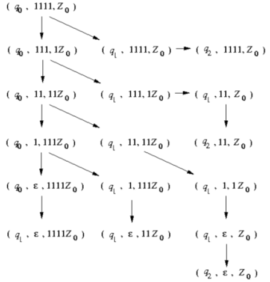

## 下推自动机接受的语言(按最终状态接收/按空栈接收)
1. Acceptance by the final state
𝐿(𝑃)={𝑤 ┤|  (𝑞_0,𝑤,𝑍_0 ) ⊢^∗ (𝑞,𝜖,𝛼)∧𝑞∈𝐹}

2. Acceptance by the Empty Stack
𝑁(𝑃)={𝑤 ┤|  (𝑞_0,𝑤,𝑍_0 ) ⊢^∗ (𝑞,𝜖,𝜖)}

## 两种接收状态的转换
1. From 𝑁(𝑃_𝑁) to 𝐿(𝑃_𝐹)(空栈->状态接收)
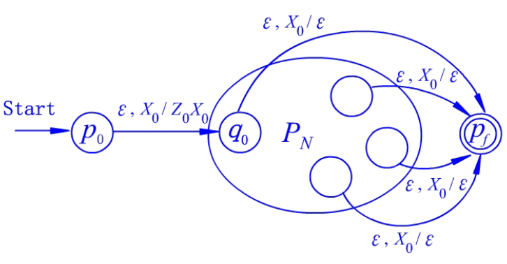
2. From 𝐿(𝑃_𝐹) to 𝑁(𝑃_𝑁)
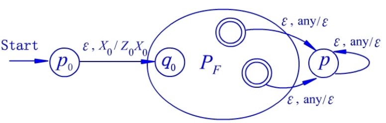

# CFG和PDA的等价性
L is a language generated by a CFG iff it is accepted by a PDA
a PDA accepts by empty stack
a PDA accepts by final state

## From CFG to PDA
Define 𝑃_𝐺=({𝑞},𝑇,𝑉∪𝑇,𝛿,𝑞,𝑆)
1. For any 𝐴∈𝑉, 𝛿(𝑞,𝜖,𝐴)={(𝑞,𝛽)|  𝐴→𝛽∈𝑅}
相当于在栈中重复了CFG的生成过程
2. For any 𝑎∈𝑇, 𝛿(𝑞,𝑎,𝑎)={(𝑞,𝜖)}
消消乐

## From PDA to CFG
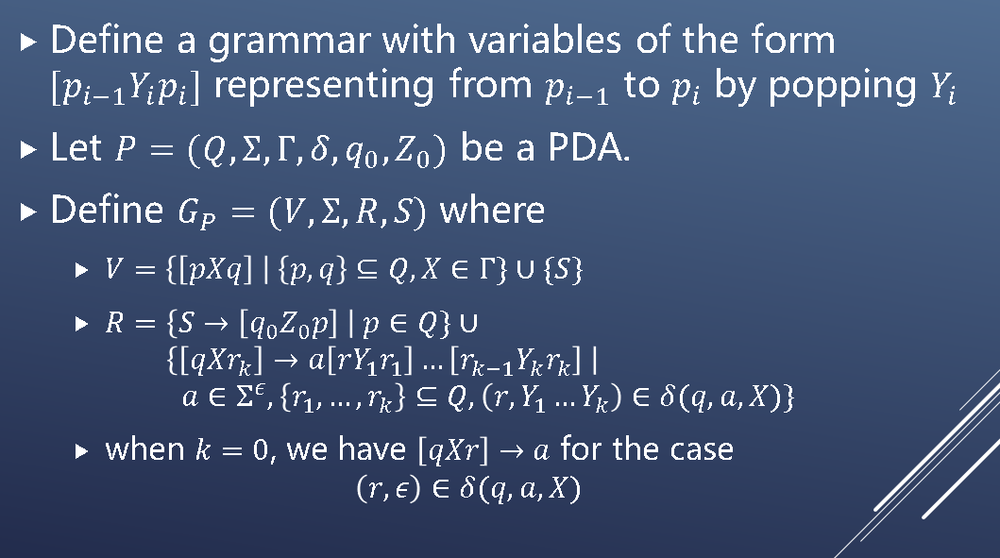
### example
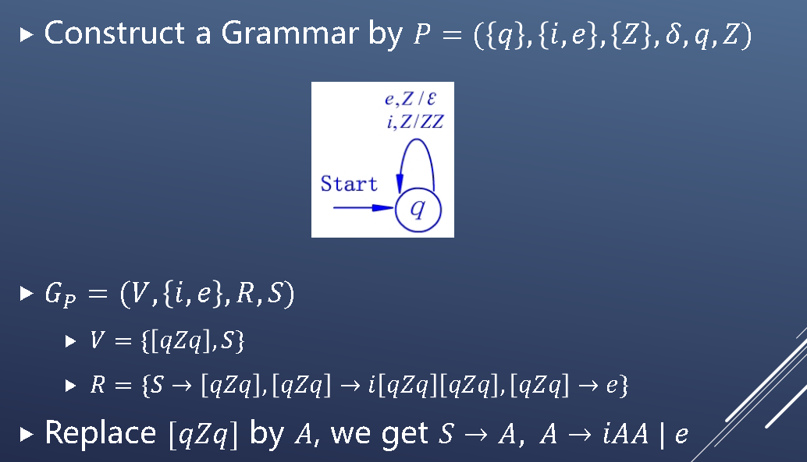

# 上下文无关文法的范式
## Chomsky Normal Form (CNF)
Every production is of the form 𝐴→𝐵𝐶 or 𝐴→𝑎
𝐴,𝐵,𝐶∈𝑉 and 𝑎∈𝑇
## Greibach Normal Form (GNF)
Every production is of the form 𝐴→𝑎𝛼
𝐴∈𝑉, 𝑎∈𝑇 and 𝛼∈$𝑉^∗$
## CFG的化简
### 三个子算法
1. Eliminate useless symbols(generating and reachable)
A symbol 𝑋 is useful if there is a derivation($𝑤∈𝑇^∗,𝑋∈𝑉∪𝑇$)
$$S \Rightarrow^* aXb \Rightarrow^* w$$
- Generating: 𝑋⇒^∗ 𝑤 for some 𝑤∈𝑇^∗
即X最后能全部转化为非终止字符
算法：
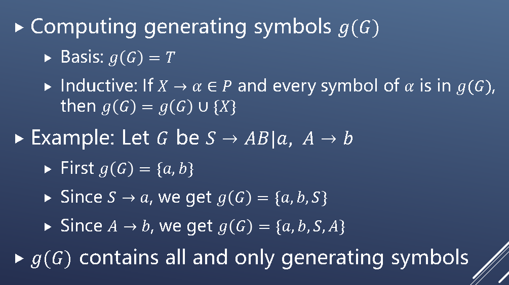
- Reachable: $𝑆\Rightarrow^∗$ 𝛼𝑋𝛽 for some {𝛼,𝛽}⊆(𝑉∪𝑇)^∗
初始状态能够到达X
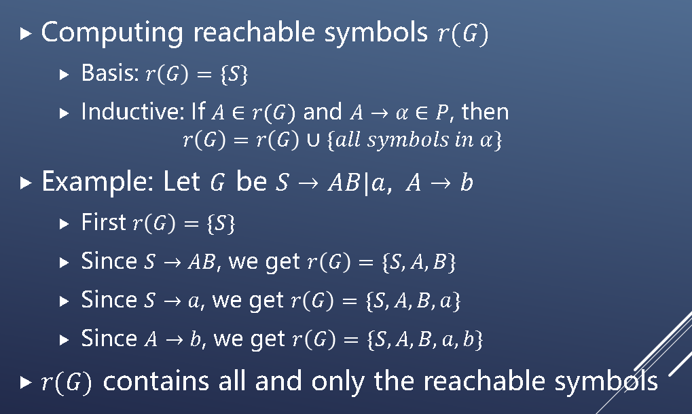
**替换**
直接把包含这些符号的式子去掉
1. Eliminate 𝜖-productions
**算法**
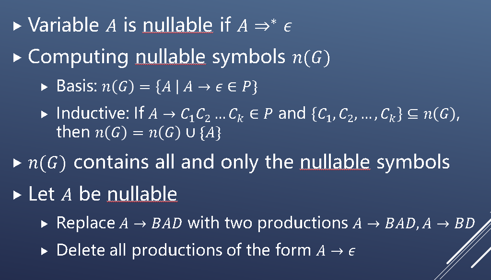
**替换**
把右侧为空的表达式去掉，再枚举可能为空的变量，如A为空，S->aAA可以变为S->aAA|aA|a
**Theorem**
If 𝐺 is CFG and 𝐺_1 is obtained by eliminating 𝜖-productions in 𝐺, then $𝐿(𝐺_1 )$=𝐿(𝐺)\\ {𝜖}

3. Eliminate unit productions
that 𝐴→𝐵

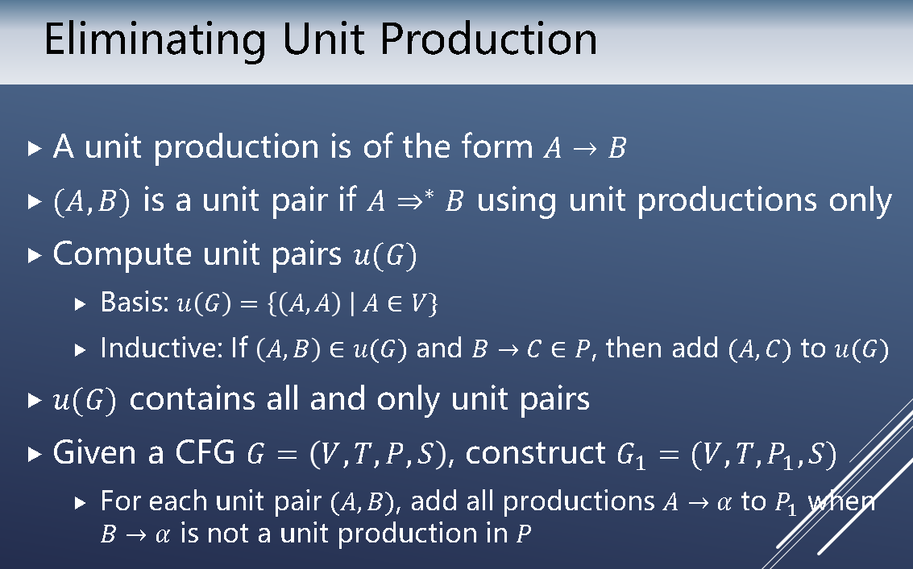
### 顺序
A safe order for simplifying a CFG
Eliminating 𝜖-productions
Eliminating unit productions
Eliminating useless symbols
**Theorem** 
If 𝐺 is a CFG that 𝐿(𝐺)≠∅, then there is another CFG 𝐺′ that has no 𝜖-productions, unit productions and useless symbols such that𝐿(𝐺^′ )=𝐿(𝐺)\\ {𝜖}

## CFG TO CNF
1. CFG化简
2. 替换终止符
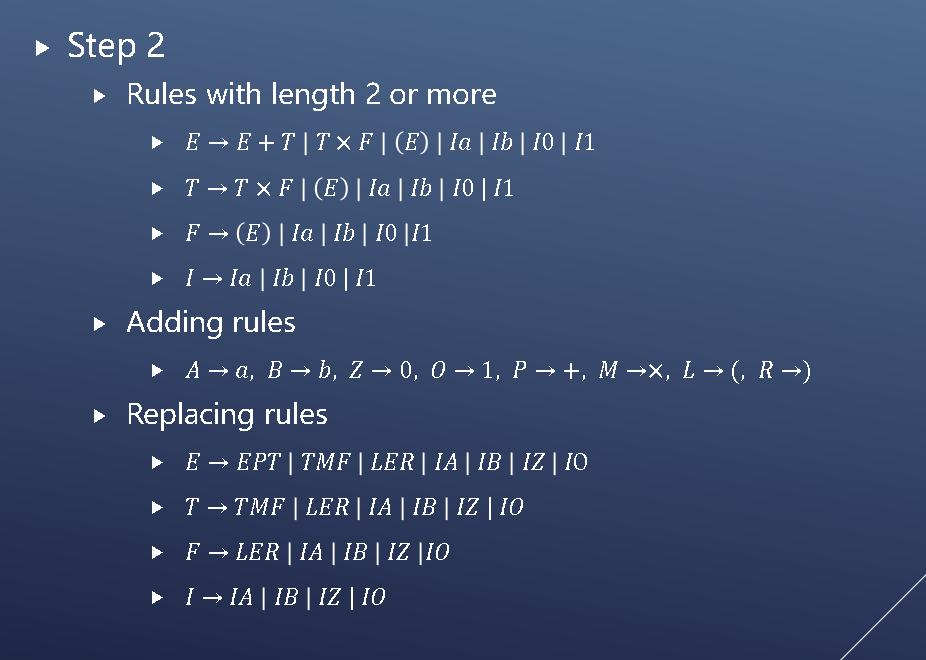
3. 替换长度大于2的产生式 
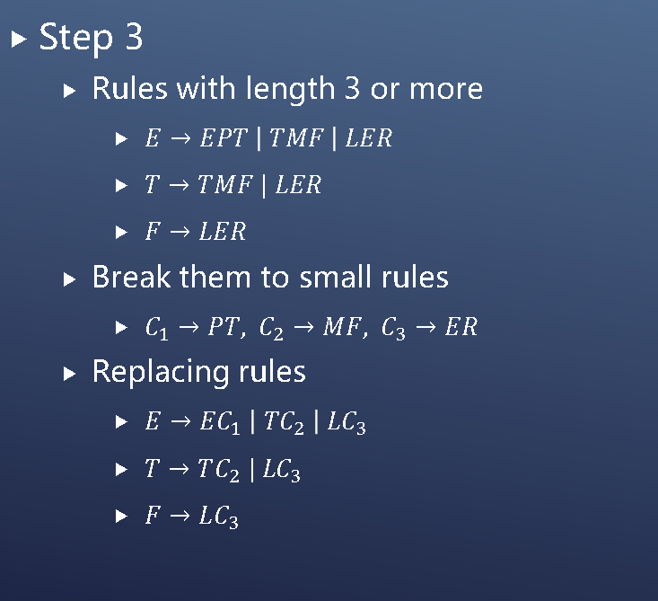
### 优点
1. Remove redundancy from grammar
2. Determine the equivalence of two CFLs by comparing the rules of their grammars
3. Make the parse tree of a string w to be a binary tree 
so that the depth of the parse tree satisfies |𝑤|≤2^(𝑛−1)

## Pumping lemma for CFL(泵引理)
Let 𝐿 be a CFL. Then there exists a constant 𝑛 such that if 𝑧 is any string in 𝐿 with |𝑧|>𝑛, then we can write 𝑧=𝑢𝑣𝑤𝑥𝑦 where
- |𝑣𝑤𝑥|≤𝑛
- |𝑣𝑥|>0
- For all 𝑖≥0, 𝑢𝑣^𝑖 𝑤𝑥^𝑖 𝑦∈𝐿
Two substrings 𝑣 and 𝑥 can be pumped

# 上下文无关语言的判定性问题
## 𝑤∈𝐿
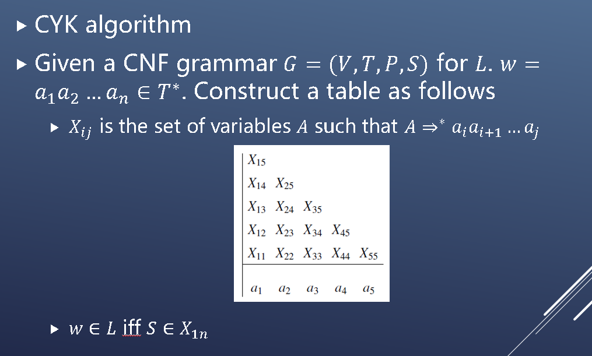
### example
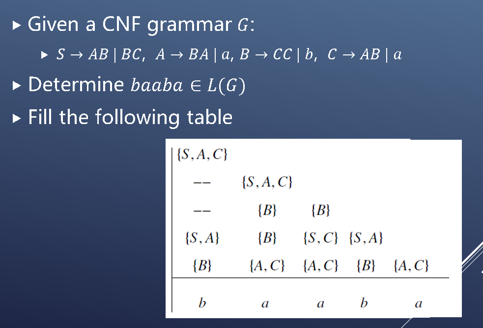

## Undecidable Problems about CFLs
- Is a given CFG G ambiguous?
- Is a given CFL inherently ambiguous?
- Is the intersection of two CFLs empty?
- Are two CFLs the same?
- Is a given CFL equal to Σ^∗?