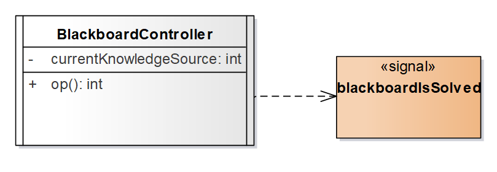

# Active Class 主动类
是一个类，其实例是主动对象，拥有一个或者多个进程|线程其实例可以独立运作、决定自己的行为
# Active Object 主动对象
是一个对象，拥有一个进程、或线程，并能够启动控制活动
是主动类的对象

# 进程、线程
进程 Process
是一个能与其它进程并发执行的重量级的流
线程 Thread
是一个能与同一进程中的其它线程并发执行的轻量级的流
UML中，用主动类表示进程或者线程
进程/线程的图形表示
在（主动）类符号、构件符号的基础上进行构造
《thread》、《process》

