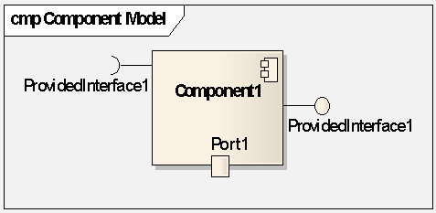
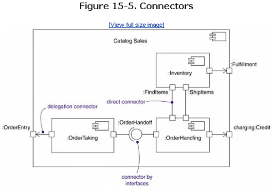
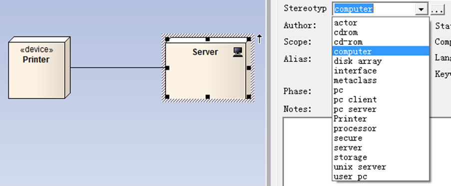

# 构件
定义了良好接口的物理实现单元，它是系统中可替换的部分
构件图用于描述软件构件以及构件之间的组织和依赖关系
是对  面向对象系统的物理方面建模时使用的两种图之一（另一种图是部署图） 
# 构件图的基本组成
构件(component) 
接口(interface) 
关系(relationship) 
类表示逻辑抽象，而构件表示存在于计算机中的物理抽象
# 主要成份
部件Part: 
端口 port：	

连接件Connector：

节点和构件的关系 
构件是参与系统执行的事物，而节点是执行构件的事物。

# 部署图（deployment diagram) 
展示 运行时 进行处理的节点和在节点上生存的制品（artifact）的配置
## 构成部署图的元素
1. 节点(node) 
存在于运行时并代表一项计算资源的的物理元素，
两种类型：
处理器（Processor）：能够执行软件构件、具有计算能力的节点。
设备（Device）：没有计算能力的节点，通常是通过其接口为外界提供某种服务，例如打印机、扫描仪等都是设备 
UML：使用构造机制(<<processor>>,<<device>>)

2. 构件(component) 
3. 关系(relationship) | connection 
依赖关系和关联关系
Rose中只有一种：连接（connection)
Cf:  Link | Relationship ? 
