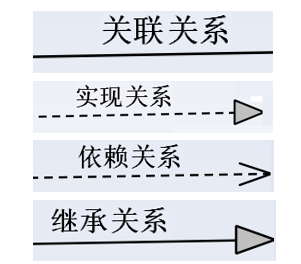
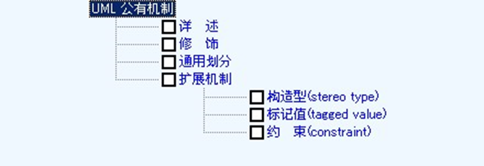
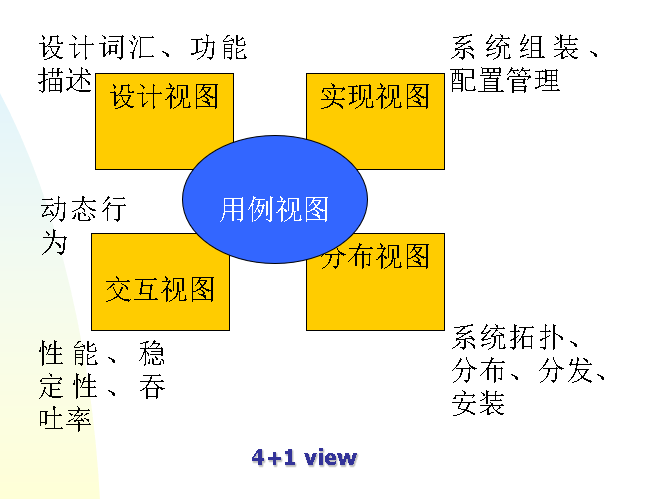
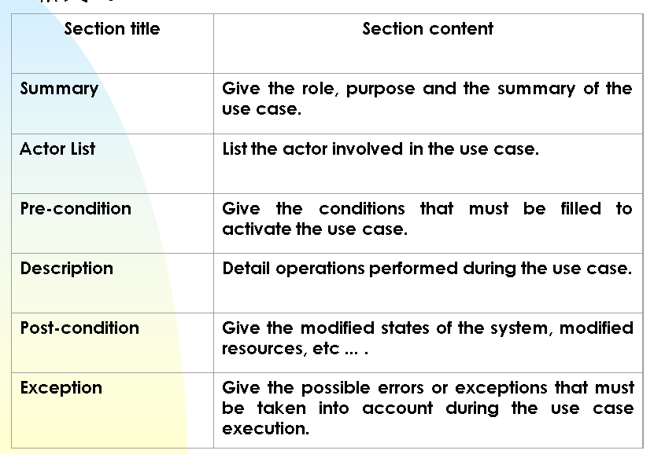

# 关系

- 关联关系
两个事物之间是一种 组织、结构关系，持续时间是稳定的
- 依赖关系
两个事物之间的关系是短暂的、一方依赖另一方；箭头指向被依赖的一方
- 继承关系（泛化关系）
一般事物与特殊事物之间的关系
- 实现关系
接口与具体实现事物之间的关系（插座 与 发电厂）

# 公共机制 

- 详述
详述==规格说明、规约，specifications. 主要以文字描述为主
- 修饰
基本符号之上，再增加的细节，以便表达得更完美
- 通用划分
相关概念之间的区分，（类、对象）（接口、实现）
【（类型、角色）注可以淡化】

# 用例 UseCase 与需求
## 4+1”view

## 需求的两种分类方法
1. Functional / Non-functional
- Functional
what the system should do 系统做的事情
- Non-functional
constraint on the system 系统的质量属性

1. FURPS+
功能性（Functionality）
可用性 Usability
可靠性 Reliability
性能 Performance
可支持性 Supportability
+：指一些辅助性的和次要的因素
资源限制、语言工具、硬件；接口的约束、包装、授权许可证等

## 系统边界  from user view

- 立足于当前要解决的问题领域，系统边界描述了系统内部与外部之间交互的集合
- 此处，系统是相对的，相对于开发人员所要分析解决的问题领域
- 系统边界随着所处的视点（view）不同而变化

## 参与者（Actor）
可以用系统参与者建模的事物
1. 软件系统的使用者
2. 直接和软件系统交互的软件系统赖以运行的软/硬件
3. 与软件系统有信息交换的计算机外部设备
## 用例UseCase  （ 另一种翻译法：用况)
系统为响应参与者引发的一个事件而执行的一系列的处理/动作，而这些处理应该为参与者产生一种有价值的结果

## 用例图
## 用例图中的关系
- 关联关系 association
图符： 实线+无箭头
- 泛化关系 generalization
图符： 实线+空心箭头，箭头指向一般事物，箭尾指向具体事物
- 依赖 dependency
图符：虚线+杈箭头，箭头指向被依赖事物，箭尾指向依赖事物
- 实现 realization
图符： 虚线+空心箭头，箭头指向被实现事物，箭尾指向实现事物
- 包含关系(用例图) 《includes》
- 扩展关系(用例图)《extended》

## 用例的描述

角色的定义
一个参与特定语境的实体的行为。

# 包 Package，是UML用来组织建模元素的机制
为了有效地控制和管理模型的设计、表达和更改，达到有效地可视化、详述、构造和文档化的目的，必须对模型元素进行组织
