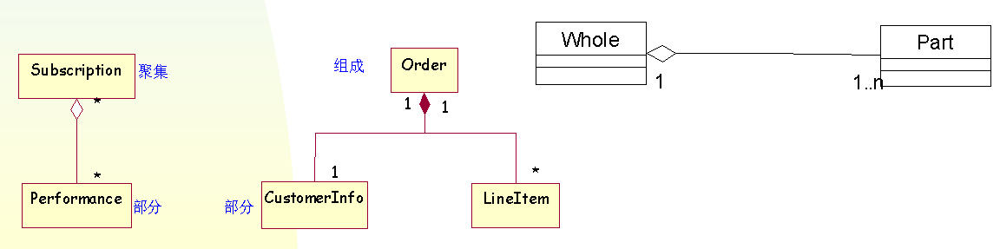

# 定义
具有相同属性（或者数据、信息、状态）、相同行为（或者方法、操作）的一组对象的描述符
类捕获了系统实现方案中的概念或词汇
# 组成
长方形，分为四个分隔区，表示四个不同部(compartment）
名称naming、属性attribute、操作operation、责职responsibility

## 名称
## 属性
## 操作
操作是一个类所能提供的服务的实现
操作是对一个对象所做事情的抽象，并且由这个类的所有对象共享
操作：
- 必须有一个名字
- 可以有参数表
- 可以有返回值

## 责职
责职（responsibility） 
是类的合约或责任（是一个类所承担的义务或协议 ）
一个良好定义的类应该有清晰的职责
一个类只应承担一种职责
类的职责划分的好坏，决定了设计方案的内聚性及耦合性

# 建模指南
类的设计决定着软件系统架构的合理性
软件部件的可维护性、可重用性、可移植性
软件系统的类的设置、职责的明确、类的属性和操作的确定，其过程可以是
- 用例驱动的 （usecase driven)
- 职责驱动的  （responsibility driven）等

# 关系 
## 依赖关系 
依赖关系是一种使用关系，说明一个事物使用另一个事物的信息和服务。

## 泛化关系
是一般事物（称为超类或父类）和该事物的较为特殊的种类（称为子类）之间的关系。

## 关联关系
关联是一种结构关系
- 指明一个事物的对象与另一个事物的对象间的联系
- 用一条实线连接两个类符号，表示这两个类之间的关联关系

自身关联
关联的两端都连到同一个类是完全合法的

## 关系修饰
- 名称
- 角色
- 多重性
- 聚合/组合
聚合： ‘整体’有管理 ‘部分’的特有的职责。它用端点带有空菱形的线段表示，空菱形与‘整体’类相连接。
组合：‘整体’拥有 ‘部分’的生命；它用端点带有实菱形的线段表示，实菱形与‘整体’类相连接。

- 导航性
- 关联类
Association class is an association that is also a class, and consists of the class, association and the dashed line.

## 连接  link
Link 是关联或关联角色的实例 
Connection between two objects are called links.
