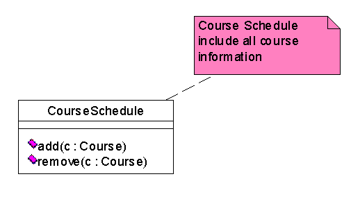

# 公共机制
是UML中适用于各种建模元素的公共建模方法
在基本建模元素图符的基础上，增加新的标识以表达更多的设计思想
UML的公共机制包括四类:
1. 修饰 adornments
注释（Note）、可见性、角色、多重性等，常见于（但不限于）关联中的说明
2. 扩充机制 extensibility mechanisms 
构造型（衍型，stereotype)、标记值(tagged value)、约束（constraint)
3. 规格说明 specifications
4. 公用划分 common divisions
类和对象的划分、接口和实现的划分、类型和角色的划分(略)
## 修饰
- 可见性

- 注解(Note)
是UML的一个图形表示，它用文字对一个（组）UML建模元素进行解释、约束
注解的图形化表示 ：一个折角矩形
矩形的内部放置注解的内容
**内容**
对被注解的建模元素没有任何语义上的影响
它只起到增强模型的可读性的作用
注解和被注解的建模元素之间用虚线连接
一个注解可以为多个建模元素作注解

## 扩充机制
### 构造型
**定义**
构造型就是类似于已有的UML建模元素
但又是对特定的问题领域具有特殊含义的新的建模元素。
**形式**
1. 记名的构造型
2. 构造型的图标形式
3. 带有图标的记名构造型

### 标记值
如果在建模的过程中，出于某种原因需要增加一个新的构成以表达建模元素的某种特性，就可以使用标记值
在UML里，标记值的放置位置没有限制
如，标记值字符串用花括弧括( {} )起来，放置到原建模元素的名字的下方
{author=Joe, status=tested, requirement=3.563}
标记值也可以被表达为一个字符串，放置到一个注解内

### 约束
在UML里，约束用来扩充UML建模元素的语义，以便增加新的规则或修改已有的规则. 
约束为对应的建模元素规定了一个条件，对于一个完备的模型而言，此建模对象必须使该条件被满足。
约束被括在一对花括号内，并被放置在被约束的建模元素附近
{ speed > 100M }  {version larger than 5.6 }

### 类的强化
从左往右，1/3/5是正常的类，2/4/6是构造型；2是边界类、4是控制类、6是实体类

- 控制类
代表一类控制或启动交互的对象
它的行为通常都是针对于一个特定的应用场景中，对象的协同、控制
例如在窗口操作系统中，对话框内的控制钮就可以用控制类来建模
- 边界类
处于系统边界上，不但和系统内部对象交互，而且又和系统外部的系统参与者交互的一类对象。
例如：软件系统的通用外部设备，如打印机、显示器、键盘及其驱动软件等
- 实体类
实体类是一类被动的对象，它本身不会启动交互，可以参加多个用例的交互，并且存活于任何单独的交互之外
例如软件系系统中的文件、数据库

# 术语
- Domain 领域
指要解决的问题在现实中所处的行业、位置、关系等。
- System：系统
由 为完成一定目的而组织起来的子系统组成，由通过不同视点(view) 得到的模型集来描述
- Subsystem 子系统,
是一组元素的集合，代表了系统的一个部分，它有清晰的接口，这个接口可作为一个单独的构件来实现 
- Model 模型
表示对现实的完整而又自我一致的简化，可以更好地理解系统。
- View 视图
是对系统模型的组织和结构的投影，注重于系统的一个方面
- Diagram 图	
一组元素的图形表示
通常表示成由顶点（事物）和弧（关系）组成的连通图
利用图可以从不同的角度（视图）来观察、可视化系统
每个元素可以出现在一个图中，也可以同时出现在多个或所有的图中

# 图
## 分类
结构图-用于观察系统静态部分的图：类图、对象图、构件图、部署图、组合结构图、制品图
行为（动态）图-用于观察系统动态部分的图：用例图、顺序图、通信图（协作图）、状态图、活动图