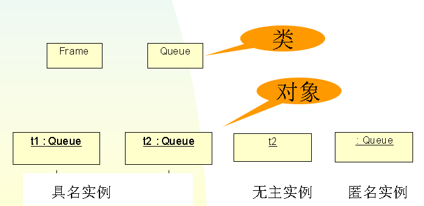
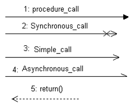
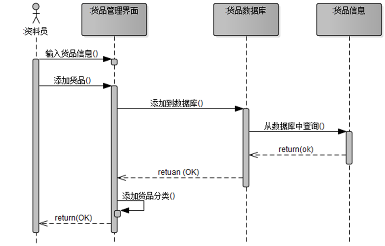
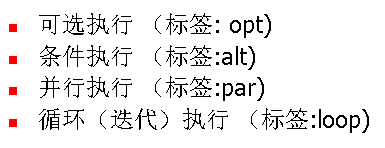
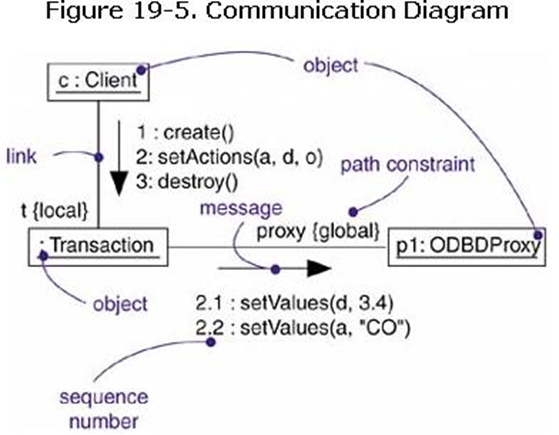

# 实例
抽象概念的具体存在，被称为实例
任何一个实例都可以与一个或多个抽象概念相对应
e.g. 某人，是一个实例
他是一个小学老师，也可以是业余运动员 etc
对应多个概念
## 命名
[名称]  ：[类型]
- 名称
带有下划线的字符串
具名实例： <u> c1:ClassA,c1</u>
孤体实例（orphan objects)
一个实例有一个 类型。实例的类型必须是具体的类目（classfier）（或类）, 如,  t : <u>Transaction</u>
- 简单名和路径名
路径名：以抽象所在的包名作为前缀，如   <u>:Multimedia::AudioStream</u>
图形表示
采用和它们的类目相同的图形符号
所不同的是在其名称加有下划线 以及（或者）冒号

# 交互
对象之间为实现某一功能,必须实施的协作过程、动态行为，称为交互
## 消息
一个对象以某种方式启动另一个对象的活动,这种交流在UML里被定义为消息
### 形式

- 调用（call）：启动某个对象的操作
操作是对象所实现的服务
对象也可以给自己发送消息
- 返回(return)：操作向调用者返回一个值
用带虚线的箭头表示
- 发送(send)：向一个对象发送一个信息
同步消息 ：箭线带有实心箭头（如图中第1种）
异步消息 ：箭线带有枝状箭头（如图中第3，4种）
- 创建(create)：此消息的发送导致目标对象被创建。
在消息的各种形式中，创建和销毁消息，用消息的 构造型来表示 《destroy》《create》
- 销毁(destroy)：此消息的发送导致目标对象被销毁 

### 表示
消息可以有名字,如果对象的实现类已经确定，则此名字可以标记为实现类的某一操作的名称
消息的发送是有顺序的,在顺序图垂直方向上，由上而下顺序执行,因此每一消息都有一顺序号
### 语境
就是可以发生交互的情况、场景，如
C/S系统中，Client对象和Server对象之间有交互
在操作的实现中可以发现对象之间的交互
操作的参数、局部/全局变量
还可以在构件、节点或用例的表示中发现交互

### 对象和角色
参与交互的对象既可以是具体的事物，又可以是原型化的事物
学生张三丰、学生王海 （具体的事物，此处是对象）
学生甲、学生乙（原型化的事物，此处是角色）

### 连接
连接是关联的实例
- Association
说明对应的对象通过关联是可见的
- Self
说明对应的对象， 因为是本操作的调遣者，所以是可见的
- global
说明对应的对象在全局范围内可见
- local
说明对应的对象在局部范围内可见
- parameter
说明对应的对象 因为是一个参数，所以是可见的因为连接是关联的实例，多重性不能用于连接

# 交互图
交互图描述了一个交互, 其中包括了一系列的对象及其关系以及通过这些关系在对象之间传递的消息
交互图分为两种：
1. 顺序图 Sequence diagram
强调消息的时间顺序
2. 通信图 Communication  diagram 
强调接收和发送消息的对象的组织结构
## 顺序图
### 定义
它是交互图的一种，强调发送消息时间上的先后顺序
### 构成
- 对象生存线

- 控制焦点
控制焦点代表一个对象直接地或通过一个子过程间接地执行一个动作的那段时间
- 结构化控制(Frame,Fragment)
可选执行 （标签: opt)
条件执行 （标签:alt)
并行执行 （标签:par)
循环（迭代）执行 （标签:loop)

### 通信图

- 连接
连接可以有名字，它标在表示连接的直线上
如果有消息借助此连接关系传递
则把消息的图符沿直线方向绘制，消息的箭头指向接受消息的对象
由于仅从图符的绘制上无法在通信图上读出消息发送的顺序
所以通常在消息上保留 消息顺序号(与对应顺序图上的消息顺序一致)

### 顺序图和通信图
顺序图和通信图都来自UML的元模型中相同的信息，所以二者在语义上是等价的，可以相互转化
通信图显示对象之间是如何被连接的
{local} {global}
顺序图显示消息的返回、有对象生命线、控制焦点

