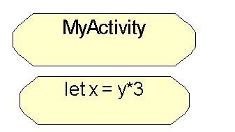
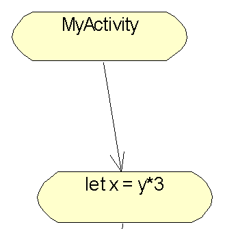
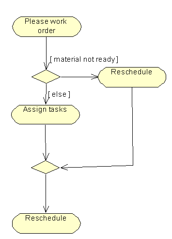
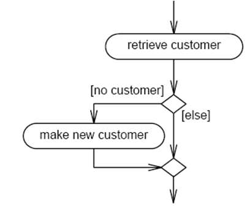
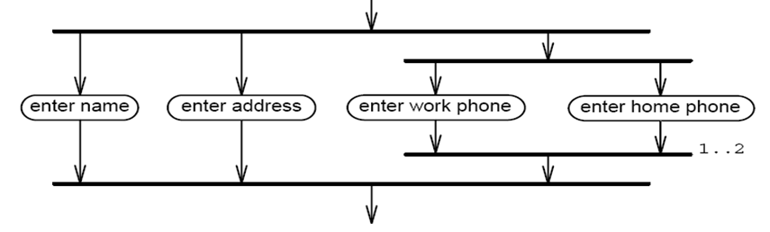
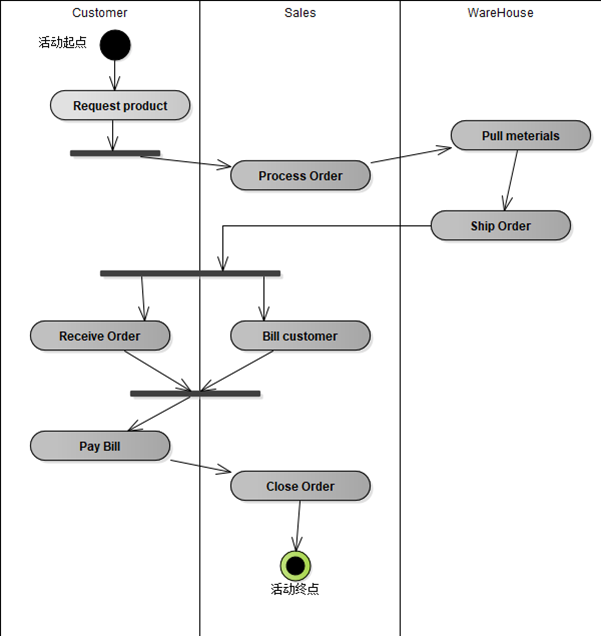
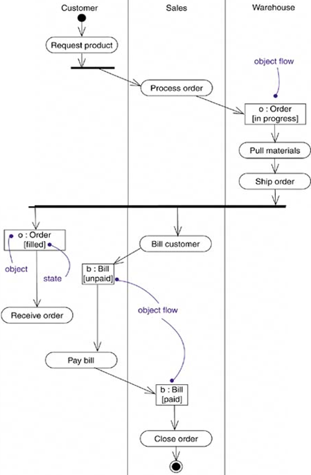
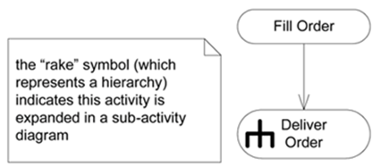

活动图描述了在一个过程中，顺序的/并行的活动及其之间的关系
# 活动与动作
- 活动
一个业务过程中进行的、非原子的执行单元
活动的执行最终延伸为一些独立动作（Action）的执行
- 动作
原子性
要么执行，要么不执行，不能执行一部分
每个动作将导致系统状态的改变或消息传送
动作包括调用另一个操作、发送一个信号、创建或撤消一个对象
## 动作和活动节点
用一个两头为圆形的方框来表示
动作是一个特别的活动节点，它不能被细分
在图形表示上，活动节点和动作没有区别 

## 控制流
用叉箭头来表示控制流 从一个节点传到另一个节点

## 分支
- 一个分支可以有一个进入流和多个离去流 
- 在每个离去流上必须设置一个监护条件
条件放在方括号里
条件不能重叠
可以有 [else] 分支
- 两个控制路径可以重新合并，无需监护条件

- 合并节点

## 分岔 和 汇合 （Forking and Joining ）
分岔表示把一个单独的控制流分成两个或多个并发的控制流。
汇合表示两个或多个并发控制流的同步发生，一个汇合可以有两个或多个进入转移和一个输出转移 
在UML中，用同步棒来说明并行控制流的分岔河汇合
同步棒是一条水平或垂直的粗线条
分岔和汇合条，既可以表示线程活动也可以表示用户并发活动
多重性指标指明有多少并发的行为必须被处理

## 泳道
将一个活动图中的活动分组，每一组表示某个业务组织负责的活动集
每个活动严格地属于一个泳道
- 转移可以跨越泳道
- 同步棒可以跨越泳道

泳道是包（package）的一种

## 对象流
把对象包含在与一个活动图相关的控制流当中，并用箭头将它们连接到产生或使用这些对象的活动节点上
- 活动可以创建 对象
- 活动可以 修改对象的状态

## 活动节点的嵌套

