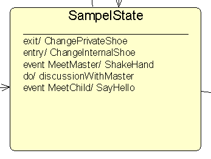
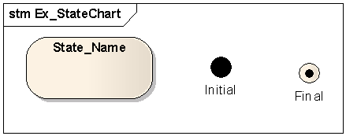
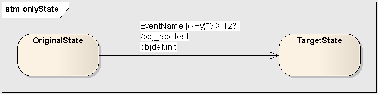
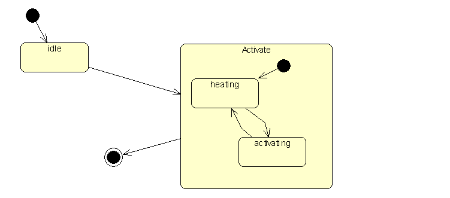

# 业务规则与建模
## 静态业务规则
任何时间节点都可以验证的规则 （可以在类模型中处理）
## 动态业务规则
只能在某些时间点才可以验证的规则，即，有事情发生时才可以验证
这些业务规则，可以通过实例（对象）的动态行为来进行验证
状态图 对实例（对象）的动态行为 进行建模 

## 顺序图和状态图的区别
比较：顺序图 也是对 对象的动态行为进行建模，区别何在？
一个是对象之间的协作 、（比较）一个是单个对象的动态行为

# 状态
## 概念
- 状态(state)
是对象的生命期中的一个条件或状况
在此期间，对象可以响应事件、执行某活动等
- 状态机(state machine) 
是一种行为，说明对象在它的生命期中, 响应事件所经历的状态序列 以及它们对每个事件的响应
- 状态图(state diagram)
状态机可以用状态图来可视化
状态图显示了一个状态机，它强调从状态到状态的控制流

## 状态依赖
- 对象的当前行为依赖于过去，
- 或者它的行为必须响应异步消息

为具有状态依赖行为的对象而不是状态无关行为的对象建立状态机图
## 状态无关
简单、独立的行为，或当前的行为并不依赖它们的过去时，不需要用一个状态机建模
- 对象的创建、撤销
- 简单地调用另一个对象的操作、偶尔随机发生的动作

## 组成
1. 名称（name）
每个单词首字母大写
2. 进入/退出动作(entry/exit action)
3. 内部迁移（internal transition）
Transitions that are handled without causing a change in state
4. 子状态 (substate)
5. 延迟事件 (deferred event)

## 图形
一般状态：圆角矩形
初始状态：实心圆
结束状态：“牛眼” (bull’s eye)

# 事件
是对一个在时间和空间上占有一定位置的、有意义的事情的描述
## 格式
触发事件名[触发条件]/迁移动作
- 这三个部分都是可以省略的，但至少有一部分
- 事件依附于表示迁移的箭线

## 事件与状态
在状态机的语境中，一个事件是一个激励的发生，它能够触发一个状态迁移

UML 对4种事件进行建模
- 参量变化 change event 布尔表达式值变化、定时器、溢出：是内部事件
- 信号 signal(异步)
- 调用 call（同步）
- 时间事件 time event
用关键字after 后面跟着时间表达式
用关键字at 表示某个绝对时间点上发生的时间事件

变化事件:表示状态的一个变化或某些条件得到满足的事件
用关键字 when后跟一个布尔表达式。当条件满足，则引发变化事件

# 迁移
在状态A，发生事件并满足一定条件，转到状态B
## 组成
- 源状态 source state
- 事件触发器 event trigger （触发事件名称）
- 触发条件 guard condition
- 效应（effect)	 （或称，迁移动作）

## 特殊迁移
自身迁移  self transition
从状态A 迁移到状态A
内部迁移 internal transition 
在状态A内部 行为

# 1. 概念:活动（Activity）和动作(Action)
- 活动 Activity
占用有限时间，并且可以中断的工作
只在一个状态内部出现

- 动作 Action
瞬时完成，并且不可以中断的工作
出现在一个状态的内部，与内部迁移相关联
出现在一个状态的外部，与外部迁移相关联

# 状态机的高级概念
## 高级状态和迁移
- 进入/退出动作(entry/exit)
不可以有监护条件
- 内部转换
内部迁移不同于 自身迁移
内部迁移只执行内部的动作， 不执行进入/退出动作
- Do 活动
当对象处于某一个状态时，希望对一个持续的活动建模
UML 用特殊的do 迁移来表示
执行了进入动作后在一个状态内部所作的工作（如一个动作序列）
- 延迟事件	
处于状态A， 来了事件e, 在A中不处理。当系统到了状态B时，处理消息e.
例如，系统需要“异步处理转为同步处理”时
## 子状态机

- 非正交子（顺序）状态
转态不相交，一次只能处于一个子系统
‘游泳’和‘开汽车’是不相交的
- 正交（并发）子状态
在一个语境中，并发地执行两个或多个状态机
如　‘等人’　和　‘看书’是相交的

