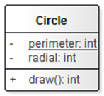
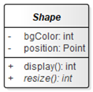
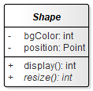
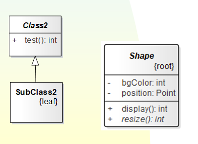
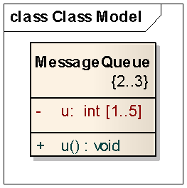
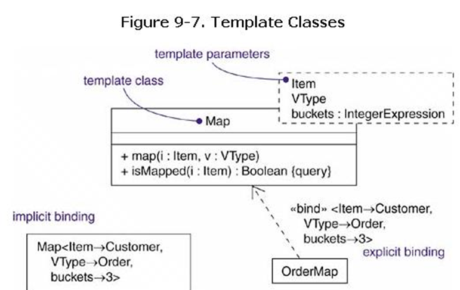
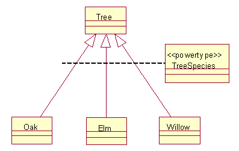
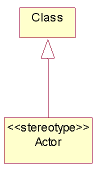
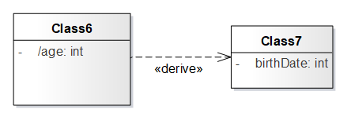

# 类目
类目是一种描述行为特征(以操作的形式）和结构特征（以属性的形式）的模型元素, 是UML中更一般的构造块
类目的种类包括
类、关联、接口、数据类型、信号、构件、节点、子系统、以及用例 （参见text ch9.2）
# 可见性
公用可见性（public），类目的构成可以被任何别的类目访问‘+’
保护可见性(protected)，类目的构成可以被此类目的导出类目访问‘#’
私有可见性(private)，类目的构成只能被此类目本身的操作访问‘-’
模型包可见性(package  ~) ：仅可以被定义在同一模型包内的类目访问
# 作用域
定义了类目的每一个实例是否都有自己独特的特征值（等价于构成的取值），还是类目的所有实例都共同拥有一个特征值
## 实例作用域(instance)（有时称为 对象作用域）
对于一个特征（feature），类目的每个实例均有它自己的值
## 类目作用域(static)
对于类目的所有实例，特征的取值是唯一的
如果类构成的名字下面加了下划线，就表示此构成具有类作用域

# 抽象类
没有直接实例的类，是抽象类（一般是基类）
在图形表示上，把抽象类的名字用斜体字拼写

# 抽象操作
抽象类里的方法（method）可以是未定义的，
它们的实现将在各导出类里定义
这样的操作被称为是抽象操作（abstract operation）

# 多态性
多态性指的是在泛化关系的层次结构中，处于不同层次的导出类的相同署名(signature) 的操作，可以有不同的动态行为

# 叶子类(leaf class)、根类(root) 
- 叶子类(leaf class)是没有任何导出类的类
图形表示：把{leaf}用花括弧扩起来，放置在类名的下方，表示对类的约束
- 根类(root)是没有任何基类的类
图形表示： 把关键字{root}, 放置在类名的下方，表示对类的约束

# 类的多重性

# 属性/操作的完整语法
## 属性语法
[可见性]名字[多重性]［:类型][=初始值]［{特性串}］
[可见性]名字[类型][多重性][=初始值]［{特性串}］
## 操作语法
[可见性]名字([参数表])［:返回类型］[{特性串}]
## 操作署名
其中，名字、参数表、返回类型合在一起，又称为操作署名(signature)
操作署名可以含有0个或多个参数：格式为
[传递方向]名字:type[=缺省值]
其中，传递方向可以取三个关键值，它们是： 
1. in：它标识本参数是输入的输入值，操作完成后本参数的取值将不被改动。
2. out：表明本参数是操作的输出参数，操作完成后本参数的取值将被修改。 
3. inout：表明本参数是一个输入参数，但在操作完成后，参数的取值可被修改
## 特性串
特性串是一个UML约束，它对操作的语义进行附加的修饰
除了前面提到的叶子操作{leaf}，{abstract}外，还可以使用下面的特性约束： 
- isQuery（query）：
它表明被修饰的操作是一个用于查询的操作，此操作执行结束之后不会改变类的状态
- Sequential: 
表明被修饰的操作在其对象内不能同时有两个以上的控制流。而这一点必须由操作的调用者来保证，对象本身不存在禁止两个控制流被同时启动的机制。 如果此操作的两个或两各以上的控制流在对象的交互中被启动，则此操作的语义和完整性将不被保证
- guarded:
调用者可以同时启动此操作的多个控制流，但这些控制流被对象自身转换为顺序执行的控制流。
这意味着当多个控制流被同时启动时，此操作的控制流或者正常执行，或者被自我阻塞，直至没有其它控制流在正常执行为止
- concurrent（并行的）：操作可以有多个控制流被同时启动，且正常的控制流可以同时运行，但操作的语义和完整性仍可保证 

# 模版类
模版类和实际类（actual class）的区别在于
1. 模版类定义了一系列的形式参数
2. 形式参数代表特定的类、对象和值，它们可以在模版类中被引用，而且其作用域只局限在模版类中
3. 在模版类的操作中,通过引用此形式参数的符号来定义对形式参数的处理
- 绑定（bind）
在UML中，模版类的形式参数和实际参数的的结合，称为绑定（bind）
可以用绑定关系来把模版类和实例化的类联系起来
绑定关系是依赖关系的一个变体，它用<<bind>>修饰，其后面是用括号括起来的绑定的实际参数列表
绑定关系的箭头指向的类是模版类
箭头起始端是实例化的类

- 实例化
通过绑定，用模版类定义具有明确语义的实际类的过程，则称为模版类的实例化（instantiate）
- 实例化的类
由模版类通过实例化产生的类，称为实例化的类（bound class, 或instantiated class）
# 标准元素
1. 元类metaclass:说明一个类目，其对象全是类
元类通常用来定义元模型（metamodel）
元类是定义类的类。
在模型图上，如果在类的名字的上方标以关键字<<metaclass>>，就代表此类是元类
2. 幂类型powertype: 说明一个类目。其对象是给定父类的子类

3. 构造型 stereotype:说明一个类目是可用于其它元素的构造型

4. 实用程序utility：说明一个类，它的属性和操作都是类作用域

# 依赖关系 Dependency
1. 绑定依赖 《bind》
2. 导出依赖 : 《derive》导出依赖是依赖关系的变体
在许多情形下，经常有一个类的两个属性是互不独立的
为了表明一个类或对象可以从另一个 计算得出，可以用导出依赖（derive）表示
如果两个类或对象之间存在着导出依赖，则表明此依赖关系中的源可以从目标中通过计算得出

允许《permit》：表示源从目标获得特定的可见性
《instanceOf  》
《instantiate 》
幂类型《powertype 》
精化（refine）: 表示源比目标处于更精细的抽象程度上
## 包之间的依赖关系
2.1引入 《import》
public contents of the target package enter the public namespace of the source, as if they had been declared in the source 
2.2访问《access》
public contents of the target package enter the private namespace of the source. The unqualified names may be used within the source, but they may not be re-exported.
## 用例之间的依赖关系
3.1《include》
3.2《extend》
## 对象之间的交互
发送《send》:源类发送目标事件
跟踪《trace》:表明目标是源的早期开发阶段的祖先

## 泛化关系上的约束
1. complete 完全
泛化模型中子类已经完全列出，不可以再增加子类
2. incomplete 不完全
子类没有完全列出，可以增加子类
3. disjoint 互斥
父类的对象最多以给定子类中的一个子类作为类型。
例如，类Person 可以特化为互斥的类man woman
4. overlapping 重叠
父类的对象可能以给定的子类中的一个以上子类作为类型
例如：类Vehicle 可以特化为重叠的子类 LandVehicle和  WaterVehicle

## 关联关系的构造型
关联名、关联端角色、多重性、聚合
1. 导航
两个类之间的一个简单的、未加修饰的关联
一般导航是双向的
但有些情况要限制导航是单向的
2. 可见性
通过对角色添加可见性符号
3. 限定
是关联的一个属性，它的值通过关联限定了与一类对象相关的对象子集。
4. 关联类
5. 聚合/组合
6. 约束
有序{order}
表示关联一端的对象是显示有序的
集合{set}
对象唯一，不可以重复
袋{bag}
对象不唯一，可以重复
有序集合{order set}
对象唯一且有序
表{list} 或序列 {sequence}
对象有序但可以重复
